## 科斗脑机调研

科斗脑机公司成立于2016年，是一家专注于脑机接口技术研发和应用的企业。研发、生产、销售各类电生理软硬件产品，并提供定制化技术服务和解决方案。公司以植入式神经微电极为核心研发方向，以医疗临床应用为目标，展开脑机接口应用落地与技术攻关。

创始人&CEO杨全威深耕电生理领域多年，带领团队总共开发出40多款神经微电极及相关设备，其中大部分产品国内首创，新申请40余个专利，产品销售应用于1千余家高校、医院等科研院所，其中所开发的神经微电极产品已经处于行业领先水平。

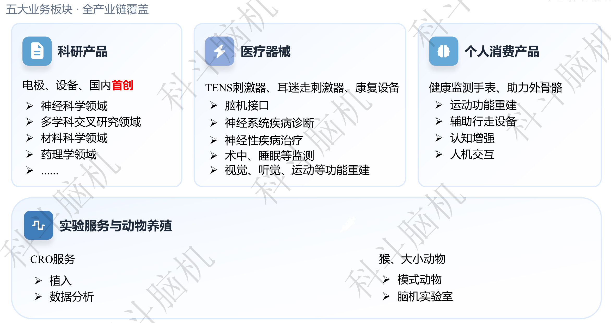

公司现有五大业务板块，科研产品、医疗器械、个人消费产品、实验服务与动物养殖均有涉及。从我的观察来看，更多还是以服务高校的科研需求为主，一区发文量也在逐年攀升。此外，公司目前也在做一些面向消费端to C的尝试，如多功能监测及电刺激手表、助力外骨骼等等。

### 电极

公司的主要业务还是销售各种各样的植入式电极，以满足各大高校的科研需求。据公司员工透露，除高校学生手工制作的电极外，采购的电极大多都来自科斗脑机公司。通过标准化的生产流程，单个电极的成本被压得极低，仅需百余元，因而很有市场竞争力。

早期电极的生产为纯人工，目前，电极生产采用半自动模式，即，机器生产标准化微丝电极，再由工人进行组装。

- 生产部很有富士康女工的氛围
- 公司有尝试过改进为全自动的生产模式，但成本过于高昂，也难以应对较多的定制需求。

公司生产的电极以微针电极为主，也有部分ECoG电极。据郭经理介绍，他们也希望做出类似Neuropixel的高密度电极，但很难获得Neuropixel的样本进行研究，研发难度较大。

多数电极较为基础，但针对不同的科研需求，也做了一些有意思的改进，如以下几项专利。

### 比较有意思的几项专利

#### （1）ECoG电极

专利：一种可植入式全脑皮层信号采集用柔性贴片电极

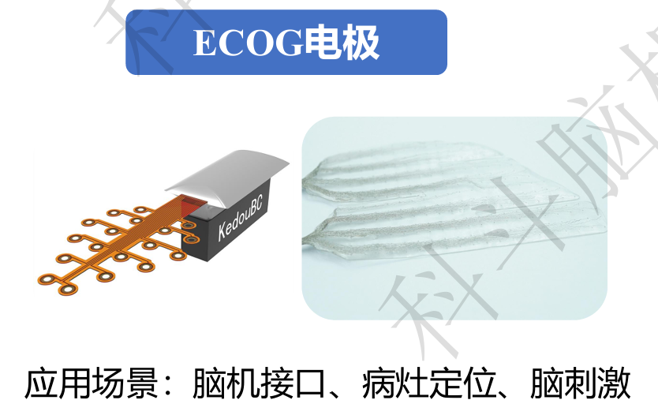

 
该电极属于典型的无源ECoG电极，通道数不多，约为30+通道，电极结构按照客户需求定制。

 

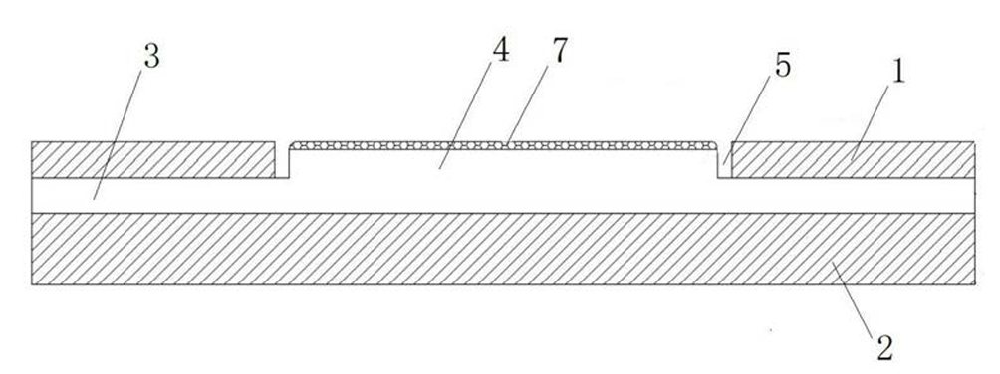

 
该图为电极的膜层结构

- 顶层覆膜1、底层覆膜2采用绝缘且具有生物相容性的柔性薄膜材料，如聚酰亚胺(PI)、派瑞林 (Parylene)、聚二甲基硅氧烷(PDMS)、聚氨酯(PU)、硅胶、硅橡胶，并通过胶黏剂或热压的形式将所述电路走线层3紧密的贴附在顶层覆膜1、底层覆膜2之间。
- 触点4采用导电且耐腐蚀的生物相容性材料，如金、铂、铂金、铂铱合金、银/氯化银、碳、石墨烯，所述触点4上可设触点涂层7，所述触点涂层7同样采用导电且耐腐蚀的生物相容性材料，如金、铂、铂金、铂铱合金、银/氯化银、碳、石墨烯。

    - 公司批量生产的电极，表面镀层基本采用铂，也是采用磁控溅射工艺。
- 电路走线层3采用导电材料，如铜、镀金铜、铂、金、碳/石墨烯、银、银/氯化银。

据郭经理介绍，该电极可以和实验室一样采用光刻加工，但大多数时候是用湿法刻蚀的工艺。

#### （2）可调微针电极

专利：一种多道独立可调阵列电极

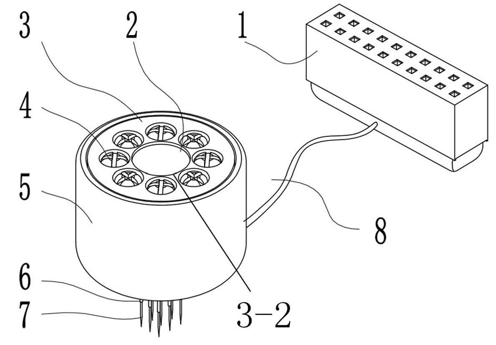

 
众所周知，微针电极在植入后会对脑组织产生损伤，会引起神经胶质细胞增殖并引发炎症反应。这时，电极几乎完全被胶质瘢痕包围，难以接触到神经元细胞，导致无法记录到信号。这一专利的设计思路就是，在电极无法检测到神经元信号后，再微调其刺入深度，使之能接触到新的神经元。

如图中所示，该发明专利每一根电极丝对应一个螺丝控制的传动结构，螺丝逆时针转动一圈，电极深入 0.25 mm，每个通道都单独可调。

#### （3）用于深部脑区的微针电极

专利：一种用于深部脑区的神经电信号采集和刺激单元

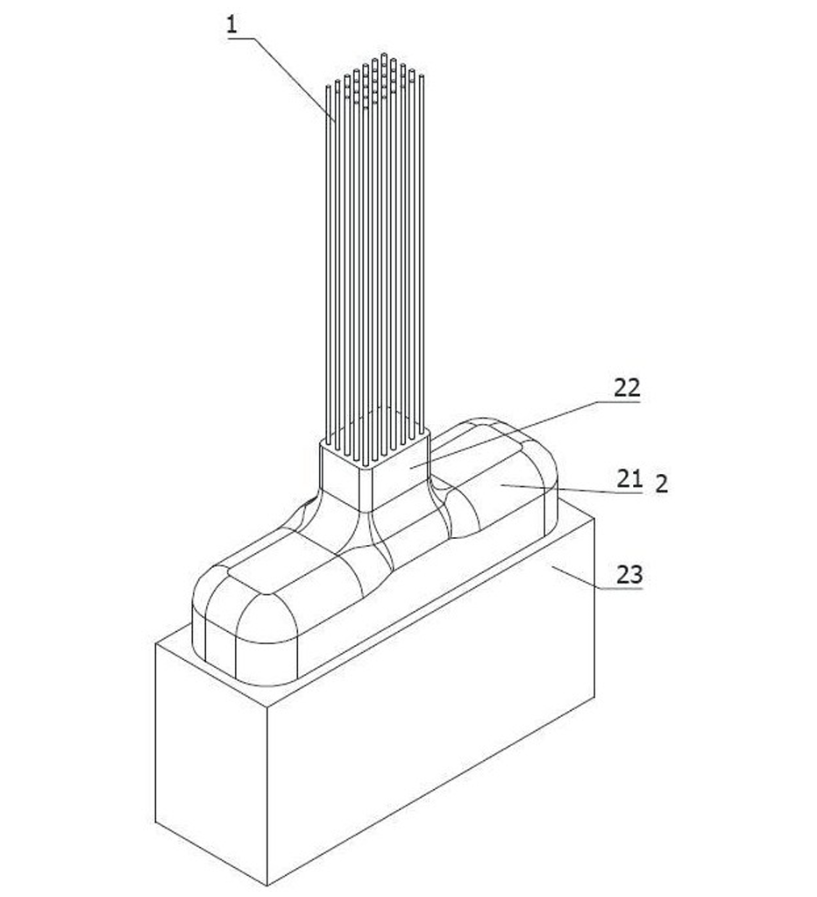

 
现有的电极丝较细且软，难以刺入深部脑区。为解决这一问题，设计了一种用于深部脑区的神经电信号采集和刺激单元，其基本单元包括如下部分：

- 电极丝，用于插入实验体的内部，材质为医用镍钛丝；
- 绝缘层，覆盖在所述电极丝的表面；
- 暴露点，形成于所述电极丝的端部，使所述电极丝的端部暴露在所述绝缘层的外侧，进而使所述电极丝的端部能够采集或者传递电信号；
- 电极端子，电连接所述电极丝和后级设备，表面设置有所述绝缘层；
- 固化组件，固化在所述电极端子和所述电极丝的连接部位，用于包裹并且约束所述电极丝的根部，使相邻的所述电极丝保持彼此平行的姿态；
- 定形件，能够在低温中固化并且遇水溶解，固化在所述固化组件和所述电极丝的连接部位，用于包裹并且约束所述电极丝的移动，使所述电极丝插入实验体的过程中保持自身的形状，并且在所述电极丝逐渐深入脑组织的过程中自行溶解。

其中最关键的就是定形件，在加工电极时用其封装电极丝，使之保持平直（只保留最前端较短的长度不封装）。植入时，遇组织液自然溶解，使得电极丝能成功植入大脑深部。

定形件采用胶原、甲壳素、纤维素、聚乙二醇、聚氨基酸、聚乳酸、聚乙醇酸、磷酸钙、磷酸三钙、丙交酯、乙交酯、乙内酯、聚酯类中的任意一种或任意几种的组合，具有类似蜡的质感。

#### （4）微针芯片模块

专利：一种微针芯片模块、适配器、培养监测装置

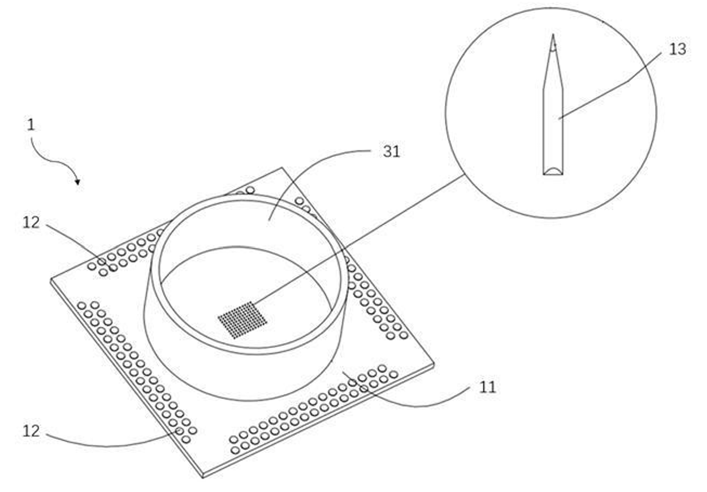

 
该装置是一种离体MEA（微电极阵列），这种细胞外记录技术，通过将多个电极以阵列的形式集成于一个芯片上，每个电极都
可以进行细胞外记录或刺激，从而实现对一群细胞的同步记录。

与传统的膜片钳技术相比，MEA技术具有以下优势：‌高通量‌，能够同时记录多个位点的细胞电生理活动，适合大规模群体细胞的研究；‌长期监控‌，支持长达数天的观察，适用于慢性神经毒性研究；‌无损伤‌：采用非侵入式记录方法，保持细胞的原始生理状态；‌高分辨率‌，能够高分辨率地记录细胞外微电压变化，反映细胞在体内的真实电生理活动。

然而，平面电极高度依赖于脑类器官与电极的贴附，仅能检测表面信号，无法长时间保持良好的三维结构，且容易在电极表面形成广泛的细胞迁移，并且组织切片或细胞簇的同一平面的外细胞层中通常包含死细胞或非放电组织，表面往往不是平面，当平面微电极阵列应用于组织切片或细胞簇的细胞外记录或电刺激时，不仅难以接触内细胞层的目标细胞，还难以贴合大部分细胞，导致平面微电极阵列中的大部分微电极难以采集到放电信号。

因此，本装置设计为微针状阵列。微针电极的直径为 25 μm，长度为 20 μm至 500 μm，材料为镍钛合金丝，尖端的形状为平面或锥形。阵列的通道数较少，为16-128通道。微针的长度可以根据需求调整，因此可以测到ECoG或Spikes信号。

脑组织放置到该装置上后，同样有压板进行固定。

这一装置也可以和之前在宣武医院试用的MEA电极作对比，那套电极（如下图）是按照细胞培养的孔板大小设计的，每个well和孔板尺寸对应，中间的芯片为CMOS传感器，共4096通道，在开启1024通道时可以实现20 kHz的高通量采集。

虽然引入CMOS芯片能够极大提升采集速率，但单个孔的尺寸过小，决定了它更适用于直接养细胞，记录神经元的电活动，而不是脑片等离体组织。

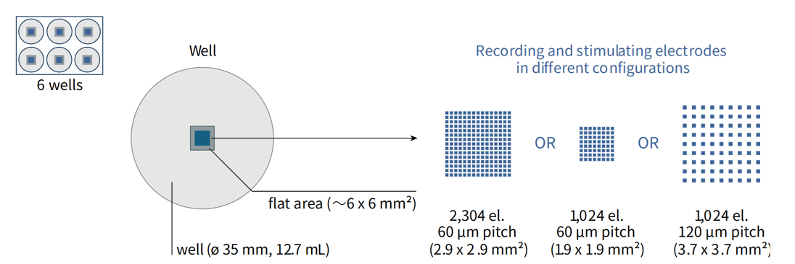

 

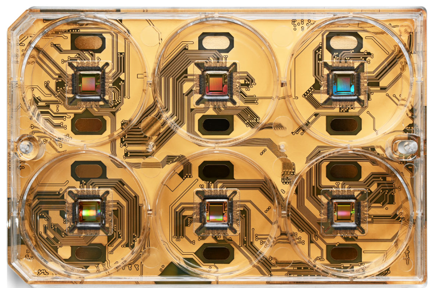

 
在宣武医院的测试实践中，测试脑片用的不是平面电极，表面有凸起；细胞是平面电极。脑组织时间久了会沉降贴附，且有一个商用anchor可以压住脑片，不损伤电极。也是类似微针的设计，但不是有创性的。

#### （5）浮动微针电极阵列

专利：一种浮动式高密度神经记录电极

侵入式电极植入脑内，接头固定在颅骨外，与外部的设备相连读取神经信号。然而，机体的呼吸和血管的搏动会导致脑组织微弱的浮动。为尽量减少植入电极带来的损伤，除了要求植入的电极丝尽量细，刺入部尖以外，还要求植入脑内的电极丝尽量柔，有弹性。此外，若植入脑内的电极丝与固定颅骨的接头直接连接，相对颅骨晃动的脑组织也会被刚性的电极丝来回切割，对脑组织损伤较大。

为了解决上述技术问题，设计了一种浮动式神经记录电极，这种浮动电极丝具有直径极细、高密度、轻质量、高弹性等特点，在植入体内后，能够随着体内组织活动。不仅减少对大脑神经元的损伤，还提高信号采集和时空分辨率的质量，延长电极工作寿命。如图所示，该器件包括以下几个部分：

- 电极接头1，浮动线2，甲壳素保护层3，可吸收基板4，植入尖端5，浮动线保护层6，电极丝7，涂覆层8，导电触点9
- 可吸收基板是设计的关键，使用甲壳素这种可吸收材料。在电极植入大脑皮层一段时间后，可吸收基板会被体液分解吸收，剩余的电极丝体积较小，可以随着皮层运动而运动。
- 浮动线2选用柔韧好、导电性强的连接线，使得电极浮动在大脑皮层上，随着脑组织运动而运动，减少对大脑神经元的损伤。浮动线一般选用 50 μm 内的金丝、银丝、镍钛合金丝、铂丝、铂铱丝、铜丝、碳纤维丝等。这些材料具有生物相容性好，柔韧性好、抗疲劳性强的特性。
- 电极丝采用10～30μm的镍钛合金丝，将电极丝一端通过电化学腐蚀或机械打磨制尖后，确定植入长度将电极丝从此处折弯，经过高温按照预定的排列形式折弯定型，再将电极丝取出全部涂覆上带有绝缘功能的涂覆层。

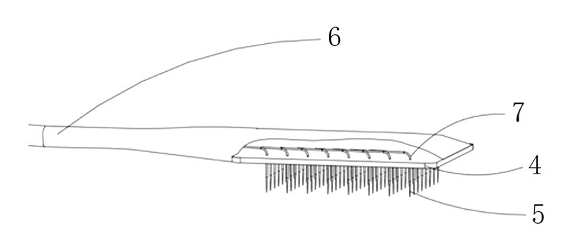

 

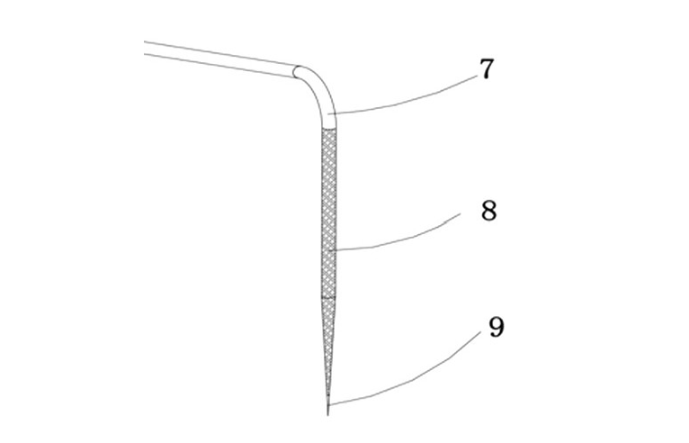

#### 其他产品

针对提到的这些专利，公司也对其进行了组合，如光纤与微针电极结合，实现光刺激+电记录，如ECoG电极与微针电极结合，实现电刺激+电记录，如给药管与微针电极结合，实现不同药理条件下的神经元活动记录......

同时，他们还为之搭建了128/1024通道的采集系统，16通道刺激系统等配套设施。

### 实验服务与动物养殖

除销售电极外，实验服务与动物养殖也是公司营收的重要来源，已经打通了从方案到交付全流程的链条。

值得一提的是，除了常见的小鼠、大鼠等小动物，猪、狗等大动物，公司还筹建了全球最大的灵长类脑机实验室，在河南省南阳市新野县建立了实验用猴养殖基地。

- 考虑到高校、医院的伦理审查更为严格，依托公司进行非人灵长类实验无疑更为简单。
- 河南新野现有猕猴存栏约10000只，依托这一核心资源，科斗脑机落地新野打造全球规模领先的非人灵长类脑机接口平台。
- 不过，给高校提供全流程解决方案，实验动物供应、手术和数据分析均由公司完成，高校老师参与度极低，是否牵扯到学术诚信问题？

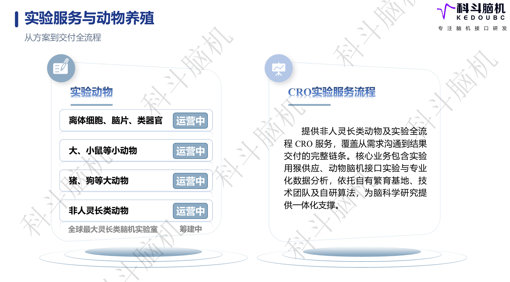

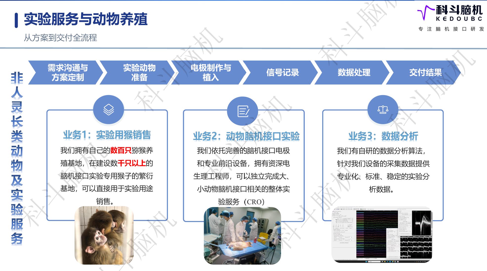

### 消费级产品

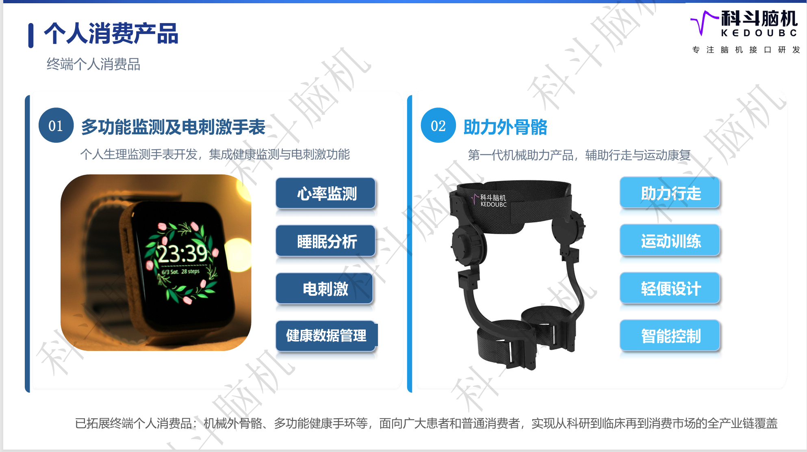

在公司体验了手表的电刺激效果，刺激感较为微弱。据公司员工介绍，该手表通过检测ECG（Electrocardiography，心电图）、血氧等其他指标，获得佩戴者的健康指标，在其处于疲劳状态时进行电刺激。

传统的智能手表通常依靠LED与光电探测器检测心率、血氧，售价在千元以下，而该手表虽然增加了心电监测、睡眠分析、电刺激等功能，但高达五六千的售价恐怕市场有限。

外骨骼助力产品了解有限，但现场试用效果不佳（可能与尺寸不合适有关）。外骨骼一般通过传感器感知佩戴者的运动意图，再由控制系统驱动机械结构产生辅助力矩，帮助人体完成运动。目前暂不清楚公司的该套产品是怎样检测运动意图，但脑部并无传感器，判断与脑电检测无关，有可能涉及到EMG（Electromyography，肌电图）的采集。

### 医疗器械

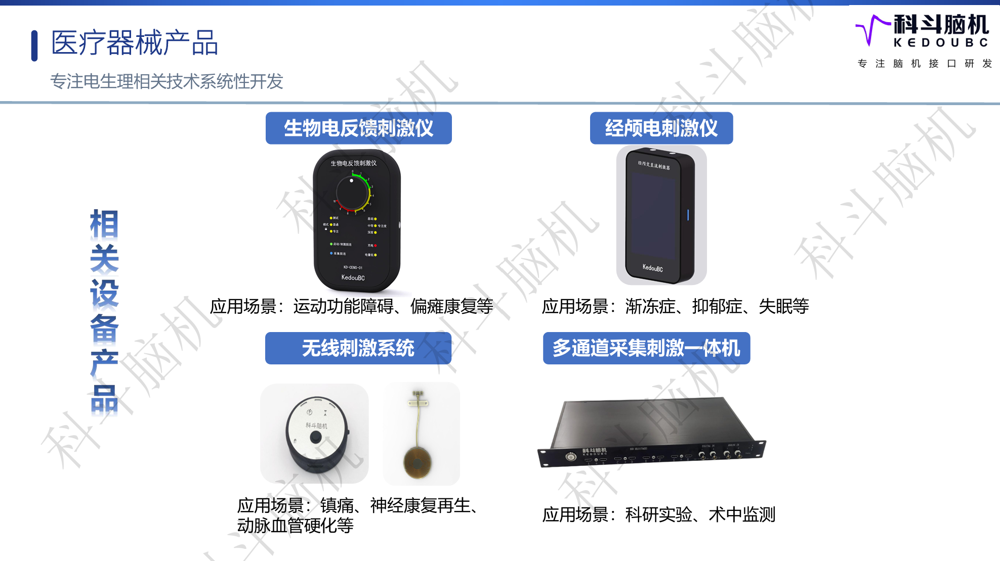

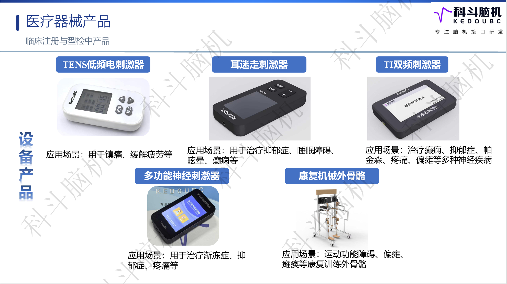