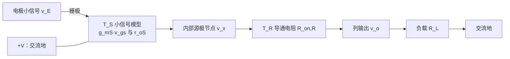
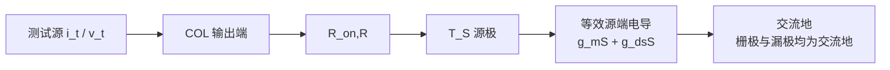
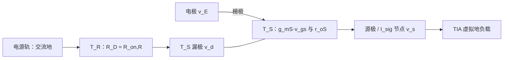
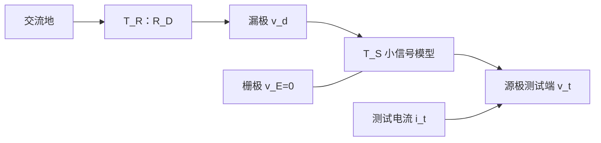
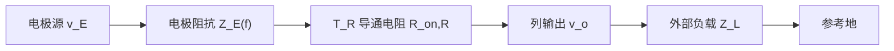
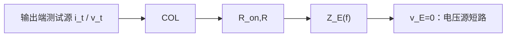

# TFT 电极阵列对比分析

本文统一比较三种电极阵列：第一种为 **柔性单晶硅衬底 2T 源极侧选通电压型阵列**，第二种为 **MoS₂ 2T 漏极侧选通电流/TIA 型阵列**，第三种为 **IGZO 1T 被动电压复用阵列**。全文严格按六章组织，并令第一、二、四章使用相同分析框架和相近篇幅。

统一符号如下：$v_E$ 为电极小信号电压，$Z_E(f)$ 为电极—组织界面阻抗，$g_m$、$g_{ds}$、$r_o=1/g_{ds}$ 分别为传感晶体管的跨导、输出电导和输出电阻，$R_{\mathrm{on}}$ 为开关晶体管的总导通电阻，$C_{\mathrm{COL}}$ 为列线总电容，$Z_L$ 为外部负载，$Z_F$ 为跨阻放大器反馈阻抗。

---

# 第一章　第一种 2T：柔性单晶硅衬底的源极侧选通电压型阵列

## 1.1 pixel 内两只晶体管的功能与次序

每个 pixel 含两只制作在柔性单晶硅衬底上的 n 型晶体管，统一命名为传感晶体管 $T_S$ 和开关晶体管 $T_R$：

- **$T_S$ 传感晶体管**：栅极连接 ELECTRODE，漏极接 $+V$，源极连接内部节点。它构成共漏极级，即源极跟随器。
- **$T_R$ 开关晶体管**：栅极连接 ROW，沟道串在 $T_S$ 源极和 COL 列线之间。它在线性区充当模拟开关。

从电源到输出的次序为：

$$
+V\rightarrow T_S\rightarrow T_R\rightarrow \mathrm{COL}.
$$

因此它属于 **传感晶体管在前、开关晶体管在后**，或称 **源极侧/输出侧选通**。$T_S$ 隔离高阻电极并提供局部反馈，$T_R$ 决定哪一行接入列线。

ROW 有效时，$T_R$ 导通，本行 $T_S$ 接入列线；ROW 无效时，$T_R$ 截止。任一列不应同时选通两行，否则多个 $T_S$ 源随器会共同驱动列线。

## 1.2 直流工作与输出类型

LM334 和 REF200 为选中列提供近似恒定的偏置电流 $I_B$。$T_S$ 的栅极几乎不吸取直流电流，源极电压随电极电压变化。直流输出近似为：

$$
V_{\mathrm{COL}}\approx V_E-V_{GSS}(I_B)-I_B R_{\mathrm{on},R}.
$$

所以该 pixel 的原始输出是 **电压**。其中 $V_{GSS}$ 是较大的直流电平移，并受阈值电压、迁移率、温度、陷阱态和偏置应力影响。该结构更适合测量电极电压的变化量；若测绝对电位，需要逐像素校准。

TLC2274 在图中接成单位增益缓冲器，其作用是隔离列线和后级，不提供显著电压增益。$15\,\mu\mathrm{F}$ 与 $1\,\mathrm{M\Omega}$ 构成高通：

$$
f_c=\frac{1}{2\pi(1\,\mathrm{M\Omega})(15\,\mu\mathrm{F})}
\approx0.0106\,\mathrm{Hz},
$$

时间常数为：

$$
\tau=RC=15\,\mathrm{s}.
$$

## 1.3 小信号模型、节点方程与电压增益

低频下忽略寄生电容。令 $T_S$ 的漏极接理想电源，因此为交流地；$T_S$ 用跨导源 $g_{mS}v_{gsS}$ 和输出电阻 $r_{oS}=1/g_{dsS}$ 表示；导通的 $T_R$ 用 $R_{\mathrm{on},R}$ 表示。内部源极节点为 $v_x$，列输出为 $v_o$，列负载为 $R_L$。

从输出端看，$T_R$ 与 $R_L$ 串联，因此 $T_S$ 源极所见等效负载电导为：

$
G_X=\frac{1}{R_{\mathrm{on},R}+R_L}.
$

由于 $v_{gsS}=v_E-v_x$，在节点 $x$ 写 KCL：

$
g_{mS}(v_x-v_E)+g_{dsS}v_x+G_Xv_x=0.
$

整理得到：

$
\frac{v_x}{v_E}=\frac{g_{mS}}
{g_{mS}+g_{dsS}+G_X}.
$

$T_R$ 与 $R_L$ 还形成分压：

$
\frac{v_o}{v_x}=\frac{R_L}{R_{\mathrm{on},R}+R_L}.
$

因此完整电压增益为：

$
A_{v1}=\frac{v_o}{v_E}
=\frac{g_{mS}}
{g_{mS}+g_{dsS}+1/(R_{\mathrm{on},R}+R_L)}
\frac{R_L}{R_{\mathrm{on},R}+R_L}.
$

当 $R_L\gg R_{\mathrm{on},R}$ 且负载很轻时：

$
A_{v1}\approx\frac{g_{mS}}{g_{mS}+g_{dsS}}
=\frac{g_{mS}r_{oS}}{1+g_{mS}r_{oS}}<1.
$

故第一种阵列是电压缓冲器，不是电压增益大于 1 的放大器。

## 1.4 输出阻抗的具体推导与带宽

求 pixel 输出阻抗时，将独立输入置零，即 $v_E=0$；移除 $R_L$，从 COL 端施加测试电流 $i_t$，测得测试电压 $v_t$。

当栅极和漏极均为交流地时，观察 $T_S$ 源极，测试电压会产生跨导电流 $g_{mS}v_x$ 和输出电导电流 $g_{dsS}v_x$，故源极等效电导为：

$
G_{S,\mathrm{eq}}=g_{mS}+g_{dsS},
$

相应等效电阻为：

$
R_{S,\mathrm{eq}}=\frac{1}{g_{mS}+g_{dsS}}.
$

$T_R$ 位于输出路径并与该电阻串联，因此：

$
R_{\mathrm{out1}}=\frac{v_t}{i_t}
=R_{\mathrm{on},R}+\frac{1}{g_{mS}+g_{dsS}}.
$

当 $g_{mS}\gg g_{dsS}$：

$
R_{\mathrm{out1}}\approx R_{\mathrm{on},R}+\frac{1}{g_{mS}}.
$

列线建立时间可近似为：

$
\tau_{\mathrm{COL1}}\approx
(R_{\mathrm{out1}}\parallel R_L)C_{\mathrm{COL}}.
$

该推导说明：增大 $T_S$ 的 $g_{mS}$ 和减小 $T_R$ 的 $R_{\mathrm{on},R}$ 都能降低输出阻抗；但 $T_R$ 过宽会增加寄生电容与开关注入。
## 1.5 噪声与尺寸设计

$T_S$ 的主要噪声包括沟道热噪声、接触噪声、载流子注入噪声、陷阱引起的 $1/f$ 噪声以及阈值漂移。输入参考白噪声的 MOS 类近似为：

$$
S_{v_i,\mathrm{white}}\propto\frac{4kT\gamma}{g_{mS}}.
$$

常用低频噪声尺度关系为：

$$
\frac{S_{I_D}}{I_D^2}\propto
\frac{1}{C_{\mathrm{ox}}W_SL_S(V_{GSS}-V_{TS})f}.
$$

$T_R$ 还引入近似 $4kTR_{\mathrm{on},R}$ 的串联热噪声、开关注入和 ROW 馈通。

$T_S$ 与 $T_R$ 的尺寸目标不同。固定偏置电流并采用平方律近似时：

$$
g_{mS}\approx
\sqrt{2\mu C_i\frac{W_S}{L_S}I_D}.
$$

为了降低 $1/g_{mS}$ 和白噪声，应提高 $W_S/L_S$；为了降低 $1/f$ 噪声，应增大面积 $W_SL_S$。因此 $T_S$ 宜采用 **大面积、宽沟道、较大 $W_S/L_S$，但非最短 $L_S$** 的尺寸。具体做法是优先增大 $W_S$，$L_S$ 取中等或偏长；若增加 $L_S$ 以提高 $r_{oS}$ 和面积，则应更大比例地增加 $W_S$，避免 $g_{mS}$ 下降。只把 $L_S$ 压到最小会减小面积、降低 $r_o$，可能恶化 $1/f$ 噪声和跟随精度。

$T_R$ 在线性区的导通电阻近似为：

$$
R_{\mathrm{on},R}\approx
\frac{1}{\mu C_i(W_R/L_R)(V_{GS,R}-V_{T,R})}+R_{C,R}.
$$

所以 $T_R$ 宜采用较大的 $W_R/L_R$：优先增大 $W_R$，$L_R$ 取较短或略高于工艺最小值。可把下式作为初始目标：

$$
R_{\mathrm{on},R}\leq\frac{0.1}{g_{mS}}.
$$

但 $T_R$ 过宽会增大行列寄生电容、开关注入和扫描功耗。

第一种还必须区分 pixel 输出阻抗和后端输入阻抗。$R_{\mathrm{out1}}$ 是从 COL 向 $T_S$/$T_R$ 内部看的性质；TLC2274 的输入阻抗 $Z_{\mathrm{in,buf}}$ 是外围负载。为了避免附加衰减，应满足：

$$
|Z_{\mathrm{in,buf}}|\gg R_{\mathrm{out1}}.
$$

缓冲器之后的输出阻抗由运放闭环输出阻抗决定，可远低于 pixel 的 $R_{\mathrm{out1}}$。这与第二种用低输入阻抗 TIA 读取电流相反：第一种需要高输入阻抗电压缓冲，第二种需要低输入阻抗电流求和节点。

## 1.6 外围电路与 NI 接口

若 LM334、REF200、TLC2274 和高通已经实现，输出是低一些阻抗的电压信号。连接 NI 电压采集卡时仍应确认：

- 输出共模和峰值不超过 NI 量程；
- 增加抗混叠滤波和必要的额外电压增益；
- 用低阻缓冲器驱动电缆及板卡采样电容；
- 对行切换瞬态设置消隐和建立时间；
- 设置参考地、屏蔽、输入保护与 ESD 防护；
- 人体应用采用合规隔离与患者漏电流限制。

---

# 第二章　第二种 2T：漏极侧选通的 MoS₂ 电流/TIA 阵列

## 2.1 pixel 内两只晶体管的功能与次序

每个 pixel 同样有两只 n 型器件：

- **$T_S$ 传感晶体管**：栅极接电极，源极连接 $I_{\mathrm{sig}}$ 列线，负责把电极电压转换成沟道电流变化。
- **$T_R$ 开关晶体管**：栅极由 Row multiplexer 驱动，沟道串在电源轨与 $T_S$ 漏极之间，负责接通或切断传感晶体管的漏极供电。

从电源到输出的次序为：

$$
V_{\mathrm{rail}}\rightarrow T_R\rightarrow T_S
\rightarrow I_{\mathrm{sig}}.
$$

因此它属于 **开关晶体管在前、传感晶体管在后**，或称 **漏极侧/供电侧选通**。行关闭时，$T_S$ 失去漏极电流通路；行打开时，$T_R$ 为 $T_S$ 建立工作电压。

## 2.2 直流工作与输出类型

相关系统被称为双晶体管复用源极跟随阵列。如果源极接高阻电压负载，$T_S$ 的确可表现为源极跟随器。但图中的实际 ROC 首级是 I-to-V Conversion，运放反相输入通过反馈保持在虚拟地 $V_{\mathrm{GND}}$ 附近，列线电压摆幅很小。

因此在图示工作条件下，pixel 的原始输出应理解为 **电流 $I_{\mathrm{sig}}$**；TIA 后才变为电压。开关晶体管 $T_R$ 不直接串在源极输出线上，但其压降会减少 $T_S$ 的 $V_{DS}$ 裕量。

## 2.3 小信号模型与跨导输出的推导

令 $T_S$ 的栅极小信号为 $v_E$，源极列节点为 $v_s$，漏极为 $v_d$。$T_R$ 导通后，其等效电阻记为 $R_D\approx R_{\mathrm{on},R}$，电源轨为交流地。

$T_S$ 的漏极小信号电流采用：

$
i_d=g_{mS}(v_E-v_s)+g_{dsS}(v_d-v_s).
$

TIA 在闭环带宽内令 $v_s\approx0$。若 $T_R$ 很强，使 $v_d$ 的交流变化也很小，则：

$
i_{\mathrm{sig}}\approx g_{mS}v_E.
$

因此 pixel 的短路跨导为：

$
G_m=\left.\frac{i_{\mathrm{sig}}}{v_E}\right|_{v_s\approx0}
\approx g_{mS}.
$

若考虑 $R_D$ 和 $g_{dsS}$，漏极节点 KCL 为：

$
\frac{v_d}{R_D}+g_{dsS}(v_d-v_s)
+g_{mS}(v_E-v_s)=0.
$

该式表明有限 $R_D$ 会使漏极不再是理想交流地，并通过 $g_{dsS}$ 引入增益误差；所以 $T_R$ 必须足够强，并保证 $T_S$ 具有充足的直流饱和裕量。
## 2.4 TIA、PGA 与系统电压增益

TIA 是 **Transimpedance Amplifier（跨阻放大器）**。它把输入电流转换成输出电压，跨阻的单位是欧姆。图中的 TIA 由运算放大器、反馈电阻 $R_F$ 和反馈电容 $C_F$ 构成：$I_{\mathrm{sig}}$ 接反相端，非反相端接虚拟地参考 $V_{\mathrm{GND}}$。

负反馈会调节运放输出，使反相端电压接近非反相端：

$$
v_-\approx v_+ = V_{\mathrm{GND}}.
$$

这不是说该节点真的短接到地，而是运放依靠闭环反馈把它维持在近似恒定电位，因此称为“虚拟地”。由于运放输入电流近似为零，pixel 输出的信号电流主要流过反馈网络，并在 $R_F$ 上形成输出电压。

反馈网络是 $R_F$ 与 $C_F$ 并联：

$$
Z_F(s)=R_F\parallel\frac{1}{sC_F}
=\frac{R_F}{1+sR_FC_F}.
$$

TIA 输出为：

$$
v_{\mathrm{TIA}}(s)=-Z_F(s)i_{\mathrm{sig}}(s).
$$

负号表示反相：流入求和节点的正向电流使 TIA 输出向负方向变化。$R_F$ 决定低频电流—电压转换比例，$C_F$ 限制高频增益、补偿列线输入电容并帮助维持闭环稳定。

从电极到 TIA 输出的增益近似为：

$$
\frac{v_{\mathrm{TIA}}}{v_E}\approx-g_{mS}Z_F(s).
$$

低频时：

$$
A_{v,\mathrm{TIA}}\approx-g_{mS}R_F.
$$

若 $g_{mS}R_F>1$，系统可获得大于 1 的电压增益。后续 PGA 和单端转差分级进一步给出：

$$
A_{v2}(s)\approx-g_{mS}Z_F(s)
A_{\mathrm{PGA}}A_{\mathrm{SE-D}}.
$$

所以该系统的显著电压增益来自 pixel 跨导、TIA 与 PGA 的组合，而不是两只 pixel 晶体管独立构成高增益级。

## 2.5 pixel 输出阻抗与 TIA 输入阻抗的具体推导

必须区分 pixel 自身输出阻抗 $R_{\mathrm{out2}}$ 和外围 TIA 输入阻抗 $Z_{\mathrm{in,TIA}}$。求 $R_{\mathrm{out2}}$ 时令 $v_E=0$，在源极端施加测试电压 $v_t=v_s$，求流入 pixel 的测试电流 $i_t$。

漏极节点 KCL 为：

$
\frac{v_d}{R_D}+g_{dsS}(v_d-v_t)-g_{mS}v_t=0.
$

因此：

$
v_d=\frac{(g_{mS}+g_{dsS})R_D}
{1+g_{dsS}R_D}v_t.
$

流入源极的测试电流为：

$
i_t=(g_{mS}+g_{dsS})v_t-g_{dsS}v_d.
$

代入 $v_d$：

$
i_t=\frac{g_{mS}+g_{dsS}}
{1+g_{dsS}R_D}v_t.
$

故 pixel 自身输出阻抗为：

$
R_{\mathrm{out2}}=\frac{v_t}{i_t}
=\frac{1+g_{dsS}R_D}{g_{mS}+g_{dsS}}
=\frac{r_{oS}+R_D}{1+g_{mS}r_{oS}}.
$

若 $R_D\rightarrow0$：

$
R_{\mathrm{out2}}\rightarrow\frac{1}{g_{mS}+g_{dsS}}
\approx\frac{1}{g_{mS}}.
$

所以该源端口自身仍是低输出阻抗的源极跟随型端口，并非理想高输出阻抗电流源。TIA 之所以能读取 $g_{mS}v_E$，是因为它把 $v_s$ 钳在近似恒定电位。

TIA 向 pixel 呈现的闭环输入阻抗另为：

$
Z_{\mathrm{in,TIA}}\approx\frac{Z_F}{1+A_{\mathrm{OL}}\beta}.
$

理想电流读取要求：

$
|Z_{\mathrm{in,TIA}}|\ll R_{\mathrm{out2}}.
$

前者是外围输入参数，后者是 pixel 输出参数，不能混为同一阻抗。
## 2.6 噪声与 $W/L$ 设计

噪声来源包括 $T_S$ 的热噪声与 $1/f$ 噪声、$T_R$ 的供电调制噪声、TIA 运放电压/电流噪声、反馈电阻噪声和 PGA 噪声。反馈电阻的输入参考电流噪声为：

$$
S_{i,R_F}=\frac{4kT}{R_F}.
$$

增大 $R_F$ 可提高跨阻增益并降低反馈电阻的输入参考电流噪声密度，但会降低带宽和最大不失真输入电流。$C_F$ 必须与列电容共同设计以保证相位裕度。

$T_S$ 和 $T_R$ 的尺寸目标不同，不能只给出“都做大”的笼统结论。

### 2.6.1 传感晶体管 $T_S$

在平方律近似及固定偏置电流下：

$$
g_{mS}\approx
\sqrt{2\mu C_i\frac{W_S}{L_S}I_D}.
$$

因此提高 $W_S/L_S$ 会提高 $g_{mS}$，从而：

- 提高电压—电流转换增益 $i_{\mathrm{sig}}/v_E$；
- 提高总跨阻电压增益 $g_{mS}R_F$；
- 降低输入参考白噪声；
- 降低源极端输出阻抗，约为 $1/g_{mS}$。

低频 $1/f$ 噪声通常随有效沟道面积 $W_SL_S$ 增大而减小。因此推荐：

- **优先增大 $W_S$**，同时提高 $W_S/L_S$ 和面积 $W_SL_S$；
- $L_S$ 取中等或偏长，以提高 $r_{oS}$、改善一致性并降低短沟道和漏极调制；
- 若增加 $L_S$，应更大比例地增加 $W_S$，避免 $W_S/L_S$ 和 $g_{mS}$ 降低；
- 不宜只靠把 $L_S$ 压到工艺最小值来提高 $W/L$，因为这可能降低 $r_o$、减小面积并恶化 $1/f$ 噪声。

也就是说，$T_S$ 宜采用 **大面积、宽沟道、较大 $W_S/L_S$、但非最短 $L_S$** 的设计。代价是电极输入电容、$C_{gsS}$、$C_{gdS}$、面积和 TIA 噪声增益上升。

### 2.6.2 开关晶体管 $T_R$

$T_R$ 在线性区的导通电阻近似为：

$$
R_{\mathrm{on},R}\approx
\frac{1}{\mu C_i(W_R/L_R)(V_{GS,R}-V_{T,R})}
+R_{C,R}.
$$

因此 $T_R$ 应采用 **较大的 $W_R/L_R$**：优先增大 $W_R$，$L_R$ 取工艺允许的较短值或略高于最小值。这可以减小漏极压降，使 $T_S$ 保持在目标工作区，并使 $R_D$ 对 $R_{\mathrm{out,pixel2}}$ 的影响较小。

可用以下条件作为初始尺寸目标：

$$
g_{dsS}R_{\mathrm{on},R}\ll1,
$$

并在最坏的 $V_{\mathrm{ON}}$、阈值漂移和最大 $I_D$ 下保证：

$$
I_D R_{\mathrm{on},R}\ll
V_{DS,S}-V_{DS,\mathrm{sat},S}.
$$

第一式使 pixel 输出阻抗接近 $1/(g_{mS}+g_{dsS})$；第二式保证开关晶体管压降不耗尽传感晶体管的饱和裕量。$W_R$ 不能无限增大，否则行线负载、$C_{gdR}$ 馈通、切换电荷和功耗都会增加。

## 2.7 外围电路与 NI 接口

普通 NI 模拟输入测量电压，因此 $I_{\mathrm{sig}}$ **不能直接接入**。所需链路为：

$$
I_{\mathrm{sig}}\rightarrow\mathrm{TIA}\rightarrow
\mathrm{PGA/基线处理}\rightarrow\mathrm{抗混叠滤波}
\rightarrow\mathrm{ADC驱动}\rightarrow\mathrm{NI}.
$$

必须确定 $R_F$、$C_F$、运放偏置电流、输入电流噪声、稳定性、输出共模和量程，还要产生 $V_{\mathrm{ON}}$、$V_{\mathrm{OFF}}$、虚拟地和器件电源。若已经使用图中的完整 ROC（含 SAR ADC），更合理的是读取数字输出，而不是把内部模拟节点再次接入 NI 电压通道。

---

# 第三章　两种 2T 电路的对比

## 3.1 晶体管次序与选通误差位置

| 项目 | 第一种 2T | 第二种 2T |
|---|---|---|
| 次序 | 电源 → 传感晶体管 → 开关晶体管 → 列线 | 电源 → 开关晶体管 → 传感晶体管 → 列线 |
| 选通位置 | 传感晶体管源极/输出侧 | 传感晶体管漏极/供电侧 |
| 开关晶体管主要误差 | 直接串入输出，增加 $R_{\mathrm{out}}$ 和衰减 | 降低漏极裕量，调制工作点和 $g_{ds}$ |
| 行切换耦合 | 直接注入源极列线 | 经漏极、$r_o$ 和 $C_{gd}$ 耦合 |

第一种的 $R_{\mathrm{on},R}$ 直接出现在：

$$
R_{\mathrm{out1}}\approx R_{\mathrm{on},R}+\frac{1}{g_{mS}}.
$$

第二种的 $T_R$ 不直接串入源极输出，但若其导通压降使 $T_S$ 离开饱和区，$g_{dsS}$ 上升，跨导传输的线性度、增益和像素一致性都会变差。

## 3.2 输出量与放大机制

第一种 2T 是电压型源随器输出：

$$
v_{\mathrm{COL}}\approx A_{v1}v_E,\qquad 0<A_{v1}<1.
$$

第二种 2T 在图示 TIA 条件下是电流型输出：

$$
i_{\mathrm{sig}}\approx g_{mS}v_E.
$$

第一种的 TLC2274 约为单位增益，系统主要做缓冲；第二种通过 $-g_{mS}R_F$ 与 PGA 获得可编程电压增益。因此第二种的“放大”更多发生在阵列外，且第一级是跨阻转换。

## 3.3 输出阻抗、速度与动态范围

第一种列线为有限输出阻抗的电压节点，建立时间受 $R_{\mathrm{out1}}C_{\mathrm{COL}}$ 限制。第二种 pixel 自身的输出阻抗为 $R_{\mathrm{out,pixel2}}$，约为 $1/g_{mS}$ 的量级；接入 TIA 后，TIA 以更低的 $Z_{\mathrm{in,TIA}}$ 负载列线并将其保持在虚拟地附近。低列电压摆幅通常更适合大规模高速扫描。这里前者是 pixel 输出参数，后者是外围输入参数，不能混称为同一个“输出阻抗”。

第一种的动态范围受 $T_S$ 的 $V_{GS}$、电源裕量、恒流源顺从电压和运放输出范围限制。第二种可通过 $R_F$ 与 PGA 调节增益，但 $R_F$ 越大，允许的输入电流和带宽越小。

## 3.4 噪声比较

两种 2T 都包含传感晶体管的热噪声、$1/f$ 噪声和阈值漂移。区别在于：

- 第一种还受到源极串联开关热噪声、恒流偏置源噪声与电压缓冲器噪声；
- 第二种还受到漏极供电调制、TIA 的 $R_F$、运放及 PGA 噪声；
- 第二种可在第一级获得较大增益，使后级噪声折算到电极端时减小；
- 第一种电路简单，但若需要较大总增益，必须再增加低噪声电压放大级。

## 3.5 适用场景

- 直接测量电极电压、通道数适中、外围简单：优先考虑第一种。
- 大阵列、高扫描速率、希望列线低摆幅和可编程增益：优先考虑第二种。
- 两者都应实测器件噪声、阈值漂移、接触电阻和切换伪迹，不能仅依靠理想 MOS 模型选型。

---

# 第四章　IGZO 单晶体管 1T 被动电压复用阵列

## 4.1 pixel 内晶体管的功能与次序

每个 pixel 只有一只 IGZO TFT：

- 栅极连接 Input Select 行线；
- 沟道串在电极和 Output signal 列线之间；
- 行选中时在线性区导通，把电极直接接到列线；
- 行关闭时截止，使电极与列线隔离。

信号次序为：

$$
\mathrm{Electrode}\rightarrow\mathrm{Select\ TFT}
\rightarrow\mathrm{COL}.
$$

这只 TFT 是模拟开关，不是源极跟随器或共源放大器。pixel 内没有传感晶体管、恒流偏置或局部缓冲。

## 4.2 直流工作与输出类型

该结构的原始输出是 **电极电压**。导通后虽有电流流过 TFT 和外部负载，但该电流由电极源阻抗及负载决定，不是受控跨导输出。

1T 不产生类似源随器 $V_{GS}$ 的直流位移，也没有传感晶体管静态功耗；但列线直接看到电极界面，电极的直流偏置、极化电位、阻抗变化和运动伪迹都会直接进入输出。

## 4.3 小信号模型与电压传输推导

1T pixel 只含开关晶体管 $T_R$。选通后把它等效为 $R_{\mathrm{on},R}$；电极采用 Thévenin 模型，即理想电压源 $v_E$ 串联电极阻抗 $Z_E(f)$；外部负载为 $Z_L$。

整条通路是串联网络，其电流为：

$
i=\frac{v_E}{Z_E+R_{\mathrm{on},R}+Z_L}.
$

输出电压为 $v_o=iZ_L$，所以：

$
A_{v,\mathrm{1T}}=\frac{v_o}{v_E}
=\frac{Z_L}{Z_E+R_{\mathrm{on},R}+Z_L}.
$

当 $|Z_L|\gg|Z_E+R_{\mathrm{on},R}|$ 时，$A_v\approx1$；但它只是无源传输，不是放大。

## 4.4 输出阻抗的具体推导与带宽

求输出阻抗时，将独立电极电压源置零。理想电压源短路后，输出端到参考地的路径依次经过 $R_{\mathrm{on},R}$ 与 $Z_E$。

测试电压为：

$
v_t=i_t\left[Z_E(f)+R_{\mathrm{on},R}\right].
$

因此：

$
Z_{\mathrm{out,1T}}(f)=\frac{v_t}{i_t}
=Z_E(f)+R_{\mathrm{on},R}.
$

这表明 1T 输出阻抗通常由电极阻抗主导，并不像 2T 源极跟随结构那样出现 $1/g_m$ 的阻抗降低。若列线主要为电容 $C_{\mathrm{COL}}$，一阶近似时间常数为：

$
\tau_{\mathrm{1T}}\approx
|Z_E+R_{\mathrm{on},R}|C_{\mathrm{COL}}.
$

不同电极的 $Z_E$ 差异会直接变成通道间带宽和建立时间差异。
## 4.5 噪声与尺寸设计

1T 少了一只持续偏置的传感晶体管，因此没有传感晶体管的沟道热噪声、散粒噪声和 $1/f$ 噪声。但系统噪声仍包括电极噪声：

$$
S_{v,E}(f)=4kT\operatorname{Re}\{Z_E(f)\},
$$

以及导通开关噪声：

$$
S_{v,R_{\mathrm{on}}}=4kTR_{\mathrm{on}}.
$$

还需考虑 IGZO 开关晶体管由界面态、体陷阱、载流子数涨落或迁移率涨落引起的 $1/f$ 噪声，以及开关注入、ROW 馈通、关断漏电、工频和线缆拾取。后端放大器的电流噪声 $i_n$ 经过高源阻抗会形成：

$$
S_{v,\mathrm{AFE}}\approx e_n^2+i_n^2
\left|Z_E+R_{\mathrm{on}}\right|^2.
$$

因此 1T 的器件噪声源较少，但系统 SNR 未必最好。

开关动作还会在列线产生近似电荷注入误差：

$$
\Delta v_{\mathrm{COL}}\approx
\frac{\Delta Q_{\mathrm{inj}}}{C_{\mathrm{COL}}}.
$$

增大 $C_{\mathrm{COL}}$ 可减小单次电压跳变，却会增加建立时间；减小 $C_{\mathrm{COL}}$ 可加快扫描，却可能使注入尖峰更大。这是 1T 阵列的典型速度—伪迹折衷。可通过互补开关、dummy switch、底板采样、切换后消隐和数字基线校正缓解，但这些措施会增加外围复杂度。

在比较 1T 与 2T 噪声时，还应统一等效噪声带宽和采样时序。1T 若因高输出阻抗需要更长采样窗口，平均可以降低随机白噪声，但会牺牲每通道采样率；若强行缩短窗口，则未完全建立的确定性误差可能被误认为噪声。

在线性区：

$$
R_{\mathrm{on,ch}}\approx
\frac{1}{\mu_{\mathrm{eff}}C_i(W/L)(V_{GS}-V_T)}.
$$

总导通电阻还包括 IGZO 与源漏金属的接触电阻：

$$
R_{\mathrm{on}}=R_{\mathrm{on,ch}}+R_S+R_D.
$$

增大 $W/L$ 可降低 $R_{\mathrm{on}}$。对 1T，推荐 **优先增大 $W$，$L$ 取较短或略高于工艺最小值**，因为该器件的主要任务是作为低电阻开关，而不是获得高 $r_o$。初始尺寸目标为：

$$
R_{\mathrm{on}}\leq0.1|Z_E(f)|
$$

在整个目标频带内尽量成立，使 TFT 引入的电压衰减、热噪声和通道差异小于电极本身的影响。

但 1T 的 $W$ 不能无限增加。开关的栅源、栅漏和源漏寄生电容大致随器件面积与重叠宽度增加，会带来：

- 更大的 ROW 驱动负载和动态功耗；
- 更强的 ROW—COL 时钟馈通；
- 更多的开关电荷注入；
- 更大的关断列电容 $C_{\mathrm{COL}}$ 和更慢的建立时间。

因此正确做法是先由允许的 $R_{\mathrm{on}}$ 求出最低 $W/L$，再在扫描建立与注入仿真中寻找满足要求的最小 $W$，而不是简单选用最大宽度。若 $Z_E$ 已远大于 $R_{\mathrm{on}}$，继续增宽对总输出阻抗改善很小，反而可能降低动态性能。

对于 IGZO，接触电阻、迁移率和阈值均可能随 $W$、$L$、偏置和工艺变化，不能只用理想 $W/L$ 缩放。应制作多组 TLM 与开关测试结构，实测 $R_{\mathrm{on}}$、关断漏电、注入电荷和噪声后再确定最终尺寸。

## 4.6 外围电路与 NI 接口

1T 高阻输出不建议直接接普通 NI 电压输入。至少需要：

- 紧邻阵列的超高输入阻抗、低偏置电流、低电流噪声缓冲器或仪表放大器；
- 参考电极及共模偏置回路，防止输入悬浮；
- 直流偏置去除或伺服、必要的电压增益和抗混叠滤波；
- 低阻 ADC 驱动器，以驱动 NI 输入电容和电缆；
- 输入保护、屏蔽、接地以及行切换后的建立/消隐时间；
- 人体应用的安全隔离和患者漏电流限制。

NI 标称输入阻抗较高并不等于可以忽略其输入电容、保护网络和多路复用 SAR ADC 的瞬态负载。

设缓冲器输入阻抗为 $Z_{\mathrm{in,buf}}$。为了使电压加载误差小于约 $1\%$，可采用：

$$
|Z_{\mathrm{in,buf}}|\geq100
|Z_E+R_{\mathrm{on}}|
$$

作为保守初始目标，同时必须检查输入偏置电流产生的直流误差：

$$
V_{\mathrm{err,bias}}\approx
I_{\mathrm{bias}}|Z_E+R_{\mathrm{on}}|.
$$

因此 1T 前端往往应优先选择极低输入偏置电流和电流噪声的 CMOS/JFET 输入放大器，并将其尽量靠近阵列；单纯追求很低的电压噪声并不一定得到最低总噪声。

---

# 第五章　三种电路的综合对比

## 5.1 功能、输出量和增益

| 项目 | 第一种 2T | 第二种 2T | 1T |
|---|---|---|---|
| 材料体系 | 柔性单晶硅衬底晶体管 | MoS₂ 晶体管 | IGZO TFT |
| pixel 组成 | 传感晶体管 $T_S$ 源随器 + 源极侧开关晶体管 $T_R$ | 漏极侧开关晶体管 $T_R$ + 传感晶体管 $T_S$ | 单个开关晶体管 $T_R$ |
| 原始输出 | 缓冲电压 | 图示 TIA 条件下为电流 | 未缓冲电极电压 |
| pixel 增益 | $0<A_{v1}<1$ | $i_o/v_E\approx g_m$ | $|A_v|\leq 1$ |

| 系统大于 1 的电压增益 | 需额外电压放大器 | 可由 $g_mR_F$ 与 PGA 得到 | 需额外高阻电压放大器 |
| 静态 pixel 功耗 | 有 | 有 | 理想情况下很低 |

## 5.2 输出阻抗

三者的代表式分别为：

$$
R_{\mathrm{out1}}\approx R_{\mathrm{on},R}+\frac{1}{g_m+g_{ds}},
$$

$$
R_{\mathrm{out2}}\approx
\frac{1+g_{dsS}R_D}{g_{mS}+g_{dsS}}
=\frac{r_{oS}+R_D}{1+g_{mS}r_{oS}},
$$

$$
Z_{\mathrm{out,1T}}\approx Z_E+R_{\mathrm{on}}.
$$

这里第二种 2T 的表达式是 **pixel 自身输出阻抗**。三种 pixel 的典型本征输出阻抗排序为：

$$
|Z_{\mathrm{out,1T}}|>
R_{\mathrm{out1}}
\sim R_{\mathrm{out2}}.
$$

1T 通常最高，因为电极阻抗直接串入输出。两种 2T 都通过传感晶体管源极反馈把输出阻抗降低到约 $1/g_m$ 的量级，但第一种把 $R_{\mathrm{on},R}$ 直接串在输出端，第二种的行选电阻则通过 $R_D$ 和 $g_{dsS}$ 间接影响输出阻抗；二者的确切高低取决于 $g_m$、$g_{ds}$ 和选通电阻，不能仅凭拓扑固定排序。

第二种接入 TIA 后，还要另外考虑 TIA 输入阻抗：

$$
Z_{\mathrm{in,TIA}}\approx
\frac{Z_F}{1+A_{\mathrm{OL}}\beta}.
$$

在 TIA 环路有效的频带内通常满足：

$$
|Z_{\mathrm{in,TIA}}|\ll R_{\mathrm{out2}},
$$

因此列节点被维持在虚拟地附近。这是 **外部负载使工作节点呈低阻**，不等于 pixel 自身的输出阻抗就是 $Z_{\mathrm{in,TIA}}$。

## 5.3 噪声

| 噪声项 | 第一种 2T | 第二种 2T | 1T |
|---|---|---|---|
| 传感晶体管热噪声/$1/f$ | 有 | 有 | 无传感晶体管 |
| 开关晶体管影响 | 串联热噪声和直接注入 | 漏极调制和寄生耦合 | 串联热噪声和直接注入 |
| 偏置/前端噪声 | 恒流源、缓冲器 | TIA、$R_F$、PGA | 高阻缓冲器 |
| 后端电流噪声敏感性 | 较低 | 按 TIA 电流噪声设计 | 最高 |
| 环境与电缆拾取 | 中等 | 通常最低 | 通常最高 |

不能以“晶体管越少，噪声越低”直接排序。1T 少一个传感晶体管，却因高输出阻抗而更容易受到后端电流噪声、漏电、工频和电缆耦合影响。2T 增加本征噪声，但提供缓冲或虚拟地。最终应把所有噪声折算到电极输入端，并在目标频带积分：

$$
v_{n,\mathrm{rms}}=
\sqrt{\int_{f_L}^{f_H}S_{v,\mathrm{in}}(f)\,df}.
$$

## 5.4 扫描速度与串扰

- 1T 的速度最容易受 $(Z_E+R_{\mathrm{on}})C_{\mathrm{COL}}$ 限制。
- 第一种 2T 去除了 $Z_E$ 对列线建立的直接影响，速度较高。
- 第二种 2T 的 TIA 减小列线摆幅，通常最适合高速大阵列，但须保证闭环稳定和足够带宽。
- 三者都需要处理行选开关注入、时钟馈通、未选通漏电和列间耦合。

## 5.5 NI 接口比较

| 阵列 | 是否可直接接普通 NI 电压输入 | 必要外围 |
|---|---|---|
| 第一种 2T | 条件满足时可以，但不建议省略调理 | 偏置源、缓冲/增益、保护、抗混叠 |
| 第二种 2T | 原始 $I_{\mathrm{sig}}$ 不能直接接 | TIA、PGA、滤波、ADC 驱动，或读取 ROC 数字输出 |
| 1T | 不建议 | 超高输入阻抗缓冲、参考/偏置、增益、保护、抗混叠 |

具体 NI 型号的输入模式、量程、输入阻抗与电容、采样方式、最大安全电压和隔离等级必须查数据手册。

## 5.6 选型建议

- 最小 pixel、最低静态功耗、允许慢扫描：1T。
- 直接电压缓冲、外围复杂度适中：第一种 2T。
- 大规模、高速、低列摆幅、可编程增益和集成 ADC：第二种 2T + TIA/PGA。

---

# 第六章　综述

## 6.1 主要结论

第一种柔性单晶硅衬底 2T 的传感晶体管 $T_S$ 构成源极跟随器，开关晶体管 $T_R$ 位于源极输出侧；输出为低阻化的电压，电压增益小于 1。它的核心价值是高输入阻抗与阻抗缓冲，不是电压放大。

第二种 MoS₂ 2T 的开关晶体管 $T_R$ 是漏极供电侧开关，$T_S$ 是传感晶体管。在图示 TIA 工作条件下，pixel 把电极电压转换为 $I_{\mathrm{sig}}$，系统通过 TIA 和 PGA 获得电压增益。其列节点动态阻抗最低，适合高速大阵列。

第三种 IGZO 1T 只有一只模拟开关，直接把电极接到列线。它输出电压、没有放大、没有缓冲，输出阻抗约为 $Z_E+R_{\mathrm{on}}$。它减少器件数目和静态功耗，却把高阻电极的加载、噪声和建立时间问题交给外围前端。

## 6.2 设计时最应关注的指标

1. 目标频带内的输入参考综合噪声，而非单个 TFT 的某一噪声值；
2. 电极阻抗随频率、面积、材料和界面状态的变化；
3. TFT 的 $g_m$、$g_{ds}$、接触电阻、$1/f$ 噪声和偏置应力漂移；
4. 列线总电容、扫描建立时间、开关注入和未选通漏电；
5. 前端量程、共模、抗混叠、ADC 驱动及 NI 接口；
6. 生物电应用的隔离、漏电流限制和故障保护。

## 6.3 推荐验证流程

先实测电极 $Z_E(f)$ 和单管 DC/AC/噪声参数，再建立含接触电阻、寄生电容和开关时序的阵列模型。对三种方案分别仿真：输入参考噪声、输出阻抗、列线建立时间、通道串扰、动态范围和功耗。最后制作小规模阵列，在相同电极、相同带宽、相同采样率和相同后端条件下测量 SNR，才可得到公平结论。

## 6.4 参考资料

1. R. Vatsyayan and S. A. Dayeh, “A Comprehensive Large Signal, Small Signal, and Noise Model for IGZO Thin Film Transistor Circuits,” *IEEE Transactions on Electron Devices*, 2023. [论文 PDF](https://iebl.ucsd.edu/sites/default/files/iebl/2023-07/A_Comprehensive_Large_Signal_Small_Signal_and_Noise_Model_for_IGZO_Thin_Film_Transistor_Circuits.pdf)
2. J. M. Lee et al., “Low-Frequency Noise in Amorphous Indium–Gallium–Zinc-Oxide Thin-Film Transistors,” *IEEE Electron Device Letters*, vol. 30, no. 5, pp. 505–507, 2009. [DOI](https://doi.org/10.1109/LED.2009.2015783)
3. J. S. Lee et al., “Systematic investigation on the effect of contact resistance on the performance of a-IGZO thin-film transistors with various geometries of electrodes,” *physica status solidi (a)*, 2010. [DOI](https://doi.org/10.1002/pssa.200983753)
4. W.-S. Kim et al., “An investigation of contact resistance between metal electrodes and amorphous gallium-indium-zinc oxide thin-film transistors,” *Thin Solid Films*, 2010. [DOI](https://doi.org/10.1016/j.tsf.2010.02.044)
5. D. Xu et al., “Two-dimensional semiconductor-based active array for high-fidelity spatiotemporal monitoring of neural activities,” *Nature Materials*, accepted 2025.

