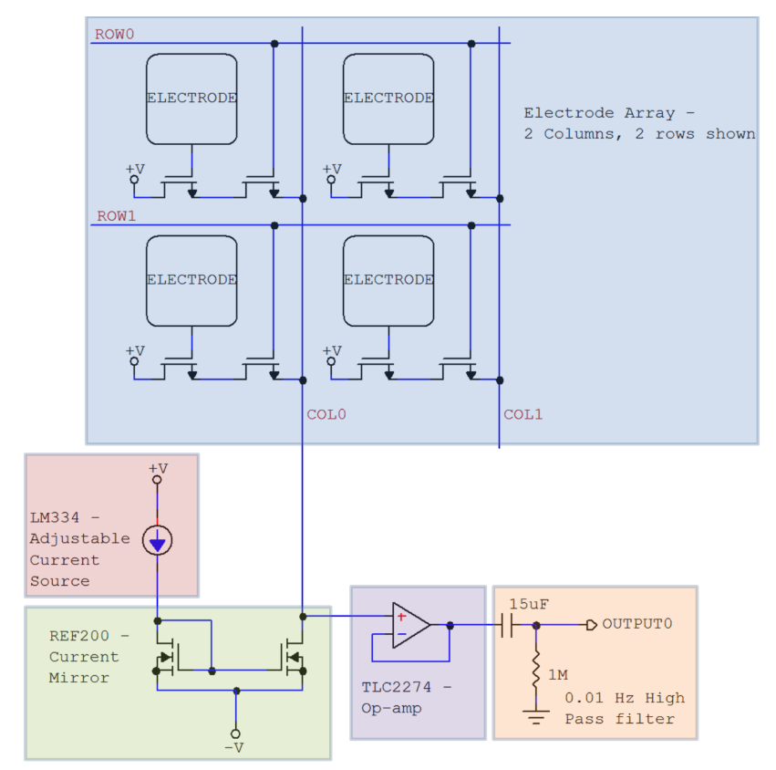
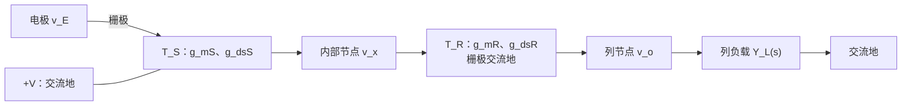
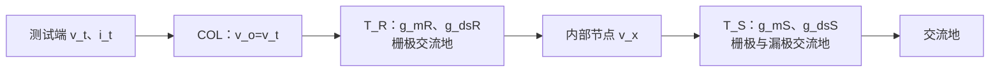
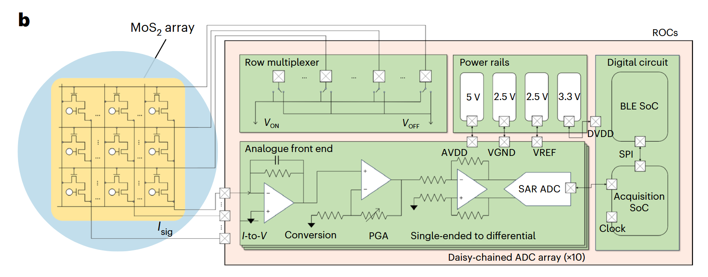
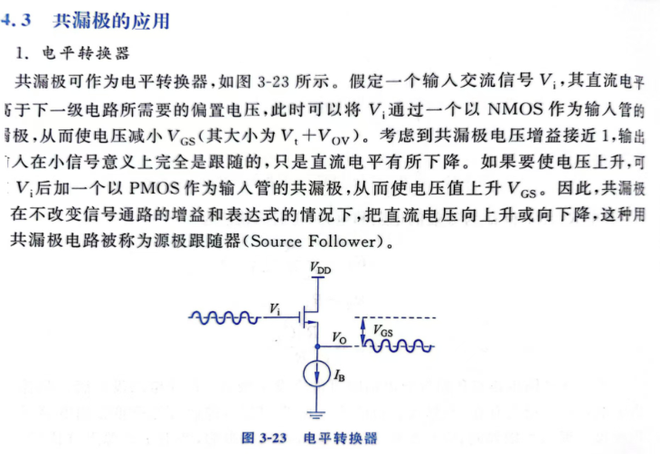
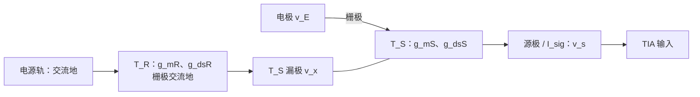
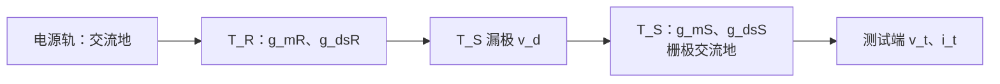
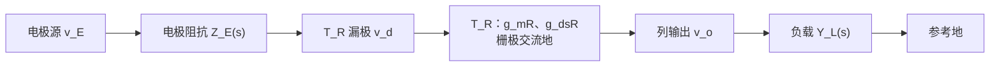
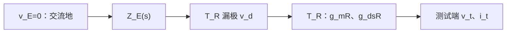

# TFT 电极阵列对比分析

本文统一比较三种电极阵列：第一种为 **柔性单晶硅衬底 2T 源极侧选通电压型阵列**，第二种为 **MoS₂ 2T 漏极侧选通电流/TIA 型阵列**，第三种为 **IGZO 1T 被动电压复用阵列**。

统一符号如下： $v_E$ 为电极小信号电压， $Z_E(f)$ 为电极—组织界面阻抗， $g_m$ 、 $g_{ds}$ 、 $r_o=1/g_{ds}$ 分别为传感晶体管的跨导、输出电导和输出电阻， $R_{\mathrm{on}}$ 为开关晶体管的总导通电阻， $C_{\mathrm{COL}}$ 为列线总电容， $Z_L$ 为外部负载， $Z_F$ 为跨阻放大器反馈阻抗。

---

# 1 第一种 2T：柔性单晶硅衬底的源极侧选通电压型阵列

 

## 1.1 pixel 内两只晶体管的功能与次序

每个 pixel 含两只制作在柔性单晶硅衬底上的 n 型晶体管，统一命名为传感晶体管 $T_S$ 和开关晶体管 $T_R$：

- **$T_S$ 传感晶体管**：栅极连接 ELECTRODE，漏极接 $+V$，源极连接内部节点。它构成共漏极连接，即源极跟随器。
- **$T_R$ 开关晶体管**：栅极连接 ROW，沟道串在 $T_S$ 源极和 COL 列线之间。它在线性区充当模拟开关。

从电源到输出的次序为：

$$
+V\rightarrow T_S\rightarrow T_R\rightarrow \mathrm{COL}.
$$

因此它属于 **传感晶体管在前、开关晶体管在后**，或称 **源极侧/输出侧选通**。 $T_S$ 隔离高阻电极并提供局部反馈， $T_R$ 决定哪一行接入列线。

ROW 有效时， $T_R$ 导通，本行 $T_S$ 接入列线；ROW 无效时， $T_R$ 截止。任一列不应同时选通两行，否则多个 $T_S$ 源随器会共同驱动列线。

## 1.2 直流工作点与输出类型

LM334 和 REF200 为选中列提供近似恒定的偏置电流 $I_B$。 $T_S$ 的栅极几乎不吸取直流电流，源极电压随电极电压变化。直流输出近似为：

$$
V_{\mathrm{COL}}=V_E-V_{GS,S}(I_B)-V_{DS,R}(I_B,V_{\mathrm{ROW}}).
$$

所以该 pixel 的原始输出是 **电压**。其中 $V_E$ 为电极电压， $V_{GS}$ 是传感晶体管的栅源电压，受阈值电压、迁移率、温度、陷阱态和偏置应力影响。 $V_{DS,R}(I_B,V_{\mathrm{ROW}})$ 是开关晶体管 $T_R$ 在偏置电流和 ROW 电压共同决定的工作点上的直流压降。

该结构更适合测量电极电压的变化量；若测绝对电位，需要逐像素校准。

TLC2274 在图中接成单位增益缓冲器，其作用是隔离列线和后级，不提供显著电压增益。 $15\mu\mathrm{F}$ 与 $1\mathrm{M\Omega}$ 构成高通滤波器：

$$
f_c=\frac{1}{2\pi(1\mathrm{M\Omega})(15\mu\mathrm{F})}
\approx0.0106\mathrm{Hz},
$$

时间常数为：

$$
\tau=RC=15\mathrm{s}.
$$

## 1.3 小信号模型、节点方程与电压增益

传感晶体管 $T_S$ 的漏极接理想电源，因此为交流地；其参数为 $g_{mS}$ 与 $g_{dsS}$。偏置电流源在交流情况下视为开路。开关晶体管 $T_R$ 的栅极由理想 ROW 电压源驱动，因此 $v_{gR}=0$，但其源极为输出节点 $v_o$，所以：

$$
v_{gsR}=-v_o,\qquad v_{dsR}=v_x-v_o.
$$

令 $T_R$ 的漏极接内部节点 $v_x$、源极接 $v_o$，其漏极小信号电流为：

$$
i_R=g_{mR}v_{gsR}+g_{dsR}v_{dsR}=g_{dsR}v_x-(g_{dsR}+g_{mR})v_o.
$$

列负载，即指从列线节点 $v_o$ 向外看，所有连接到 COL 线上的小信号负载，用导纳 $Y_L(s)$ 表示。

$$
Y_L(s)=Y_{\mathrm{REF200}}(s)+Y_{\mathrm{opamp}}(s)+sC_{\mathrm{COL}}+Y_{\mathrm{parasitic}}(s).
$$

其中， $Y_{\mathrm{REF200}}(s)$ 为电流镜负载， $Y_{\mathrm{opamp}}(s)$ 为运放负载，理想运放的阻抗无穷大，导纳为零， $C_{\mathrm{COL}}$ 为连接到该节点的所有电容之和， $Y_{\mathrm{parasitic}}(s)$ 为其它寄生阻抗。

对输出节点 $v_o$ 列写 KCL：

$$
Y_Lv_o-i_R=0
$$

代入 $i_R$：

$$
-g_{dsR}v_x+(Y_L+g_{dsR}+g_{mR})v_o=0
$$

故：

$$
\frac{v_o}{v_x}=\frac{g_{dsR}}{Y_L+g_{dsR}+g_{mR}}
$$

对节点 $v_x$ 列写 KCL：

$$
g_{mS}(v_E-v_x)-g_{dsS}v_x=i_R
$$

由输出节点 KCL 有 $i_R=Y_Lv_o$，代入 $v_o/v_x$ 后：

$$
\left[g_{mS}+g_{dsS}\frac{Y_Lg_{dsR}}{Y_L+g_{dsR}+g_{mR}}\right]v_x=g_{mS}v_E
$$

于是：

$$
\frac{v_x}{v_E}=\frac{g_{mS}}{g_{mS}+g_{dsS}+\dfrac{Y_Lg_{dsR}}{Y_L+g_{dsR}+g_{mR}}}
$$

完整电压增益为：

$$
A_{v1}(s)=\frac{v_o}{v_E}=\frac{g_{mS}}{g_{mS}+g_{dsS}+\dfrac{Y_Lg_{dsR}}{Y_L+g_{dsR}+g_{mR}}}\frac{g_{dsR}}{Y_L+g_{dsR}+g_{mR}}
$$

理想情况下，考虑 $Y_L=0$，电压增益为：

$$
A_{v1}(s)=\frac{v_o}{v_E}=\frac{g_{mS}}{g_{mS}+g_{dsS}}\frac{g_{dsR}}{g_{dsR}+g_{mR}}
$$

## 1.4 输出阻抗推导

求输出阻抗时令独立输入 $v_E=0$，移除外部列负载，用加压求流的方法，在 COL 端施加测试电压 $v_t=v_o$，并求流入 pixel 的测试电流 $i_t$。

对 $v_x$ ：

$$
(g_{mS}+g_{dsS})v_x+g_{dsR}(v_x-v_t)-g_{mR}v_t=0
$$

可得

$$
v_x=\frac{g_{dsR}+g_{mR}}{g_{mS}+g_{dsS}+g_{dsR}}v_t
$$

测试电流为

$$
i_t=-g_{dsR}(v_x-v_t)+g_{mR}v_t=\frac{(g_{dsR}+g_{mR})(g_{mS}+g_{dsS})}
{g_{mS}+g_{dsS}+g_{dsR}}v_t
$$

所以第一种 2T pixel 的低频输出阻抗为：

$$
R_{\mathrm{out1}}=\frac{v_t}{i_t}=\frac{g_{mS}+g_{dsS}+g_{dsR}}{(g_{mS}+g_{dsS})(g_{dsR}+g_{mR})}
$$

若考虑列电容和外部负载，输出节点的闭环极点必须由完整小信号网络求解，一阶估计可写为：

$$
\tau_{\mathrm{COL1}}\simeq\left(R_{\mathrm{out1}}\parallel Z_L(0)\right)C_{\mathrm{COL}},
$$

其中 $Z_L(0)=1/Y_L(0)$。

## 1.5 噪声与尺寸设计

$T_S$ 的主要噪声包括沟道热噪声、接触噪声、载流子注入噪声、陷阱引起的 $1/f$ 噪声以及阈值漂移。输入参考白噪声的 MOS 类近似为：

$$
S_{v_i,\mathrm{white}}\propto\frac{4kT\gamma}{g_{mS}}.
$$

常用低频噪声尺度关系为：

$$
\frac{S_{I_D}}{I_D^2}\propto
\frac{1}{C_{\mathrm{ox}}W_SL_S(V_{GSS}-V_{TS})f}.
$$

$T_R$ 的沟道噪声应作为其小信号漏极噪声源并与 $g_{mR}$、$g_{dsR}$ 一同通过两节点网络传递到输出；此外还存在开关注入和 ROW 馈通。

$T_S$ 与 $T_R$ 的尺寸目标不同。固定偏置电流并采用平方律近似时：

$$
g_{mS}\approx
\sqrt{2\mu C_i\frac{W_S}{L_S}I_D}.
$$

为了降低 $1/g_{mS}$ 和白噪声，应提高 $W_S/L_S$；为了降低 $1/f$ 噪声，应增大面积 $W_SL_S$。因此 $T_S$ 宜采用 **大面积、宽沟道、较大 $W_S/L_S$，但非最短 $L_S$** 的尺寸。具体做法是优先增大 $W_S$， $L_S$ 取中等或偏长；若增加 $L_S$ 以提高 $r_{oS}$ 和面积，则应更大比例地增加 $W_S$，避免 $g_{mS}$ 下降。只把 $L_S$ 压到最小会减小面积、降低 $r_o$，可能恶化 $1/f$ 噪声和跟随精度。

$T_R$ 的尺寸应直接依据工作点处提取的 $g_{mR}$、 $g_{dsR}$、接触电阻和寄生电容设计。由完整增益与输出阻抗公式可见，提高 $g_{dsR}$ 会增强 $v_x$ 到 $v_o$ 的传递并降低 $R_{\mathrm{out1}}$；而 $g_{mR}$ 反映输出节点改变 $v_{gsR}$ 后产生的受控电流效应，必须保留。工程上优先增大 $W_R$，并由实测或 compact model 验证 $g_{mR}$、 $g_{dsR}$、开关注入和列电容之间的折衷。 $W_R$ 过大会增大 ROW 负载、 $C_{gsR}$、 $C_{gdR}$ 与动态功耗。

第一种还必须区分 pixel 输出阻抗和后端输入阻抗。 $R_{\mathrm{out1}}$ 是从 COL 向 $T_S$/$T_R$ 内部看的性质；TLC2274 的输入阻抗 $Z_{\mathrm{in,buf}}$ 是外围负载。为了避免附加衰减，应满足：

$$
|Z_{\mathrm{in,buf}}|\gg R_{\mathrm{out1}}.
$$

缓冲器之后的输出阻抗由运放闭环输出阻抗决定，可远低于 pixel 的 $R_{\mathrm{out1}}$。这与第二种用低输入阻抗 TIA 读取电流相反：第一种需要高输入阻抗电压缓冲，第二种需要低输入阻抗电流求和节点。

## 1.6 外围电路与 NI 接口

若 LM334、REF200、TLC2274 和高通已经实现，输出是低一些阻抗的电压信号。连接 NI 电压采集卡时仍应确认：

- 输出共模和峰值不超过 NI 量程；
- 增加抗混叠滤波和必要的额外电压增益；
- 用低阻缓冲器驱动电缆及板卡采样电容；
- 对行切换瞬态设置消隐和建立时间；
- 设置参考地、屏蔽、输入保护与 ESD 防护；
- 人体应用采用合规隔离与患者漏电流限制。

---

# 第二章　第二种 2T：漏极侧选通的 MoS₂ 电流/TIA 阵列

 

## 2.1 pixel 内两只晶体管的功能与次序

每个 pixel 同样有两只 n 型器件：

- **$T_S$ 传感晶体管**：栅极接电极，源极连接 $I_{\mathrm{sig}}$ 列线，负责把电极电压转换成沟道电流变化。
- **$T_R$ 开关晶体管**：栅极由 Row multiplexer 驱动，沟道串在电源轨与 $T_S$ 漏极之间，负责接通或切断传感晶体管的漏极供电。

从电源到输出的次序为：

$$
V_{\mathrm{d}}\rightarrow T_R\rightarrow T_S\rightarrow I_{\mathrm{sig}}.
$$

因此它属于 **开关晶体管在前、传感晶体管在后**，或称 **漏极侧/供电侧选通**。行关闭时，$T_S$ 失去漏极电流通路；行打开时，$T_R$ 为 $T_S$ 建立工作电压。

## 2.2 直流工作点与输出类型

 

该系统中的传感晶体管的接入方式类似源极跟随器。如果源极接高阻电压负载，$T_S$ 可表现为源极跟随器。

这种接法要求输出端接高阻电压负载，且需要电流源偏置，输出信号类型为**电压**。

图中的实际 ROC 首级是 I-to-V Conversion，运放反相输入通过反馈保持在虚拟地 $V_{\mathrm{GND}}$ 附近，列线电压摆幅很小。pixel 的原始输出应理解为 **电流 $I_{\mathrm{sig}}$**；经TIA跨阻放大后才变为电压。开关晶体管 $T_R$ 不直接串在源极输出线上，但其压降会减少 $T_S$ 的 $V_{DS}$ 裕量。

**补充说明1**：为什么源极跟随器需要高阻负载？

对共漏极电路作交流小信号分析，在源极节点列KCL方程：

$$
g_m(v_o-v_i)+g_{ds}v_o+\frac{v_o}{r_B}+\frac{v_o}{Z_L(s)}=0
$$

其中，除晶体管小信号参数外， $r_B$ 为偏置电流源输出电阻。

得到电压增益为

$$
A_v(s)=\frac{v_o}{v_i}=\frac{g_m}{g_m+g_{ds}+\dfrac{1}{r_B}+\dfrac{1}{Z_L(s)}}
$$

只有在负载 $Z_L(s)\gg1$时， 

$$
A_v(s)=\frac{v_o}{v_i}=\frac{g_m}{g_m+g_{ds}+\dfrac{1}{r_B}}\approx1
$$

**补充说明2**：为什么TIA提供的是低阻虚地节点？

对于跨阻放大器求输入阻抗，同样采用加压求流的方式，反相输入端电压 $v_t$，输入电流 $i_t$。设运放的开环放大倍数为 $A(s)$，负反馈网络阻抗为 $Z_F(s)$。

$$
v_o=A(s)(v_{+}-v_{-})=-A(s)v_t
$$

$$
i_t=\frac{v_t-v_o}{Z_F(s)}
$$

可得

$$
Z_{in}=\frac{v_t}{i_t}=\frac{Z_F(s)}{1+A(s)}
$$

通常情况下，开环增益 $A(s)\gg1$，则有 $Z_{in}\rightarrow0$。

注意到，在第一种情况下，运放的连接方式是电压跟随器，输入阻抗 $Z_{in}\rightarrow\infty$

**补充说明3**：运放的输入阻抗、输出阻抗相关计算（待完成）

## 2.3 小信号模型与跨导输出推导

第二种阵列中，开关晶体管 $T_R$ 位于传感晶体管 $T_S$ 的漏极供电侧。令 $T_R$ 的电源轨端为漏极并接交流地，与 $T_S$ 相连的一端为节点 $v_x$。

此时 $T_R$ 的栅极和漏极均接交流地，受控源可等效为电阻。定义： $G_R=g_{mR}+g_{dsR}$

对漏极节点 $v_x$ 列写 KCL：

$$
G_Rv_x+g_{mS}(v_E-v_s)+g_{dsS}(v_x-v_s)=0.
$$

因此：

$$
v_x=\frac{(g_{mS}+g_{dsS})v_s-g_{mS}v_E}{G_R+g_{dsS}}
$$

输出电流为：

$$
I_{\mathrm{sig}}= g_{mS}(v_E-v_s)+g_{dsS}(v_d-v_s)=-G_R\frac{(g_{mS}+g_{dsS})v_s-g_{mS}v_E}{G_R+g_{dsS}}
$$

TIA 在闭环带宽内使 $v_s\approx0$，则跨导增益为：

$$
G_{m,eff}=\frac{I_{\mathrm{sig}}}{v_E}=G_R\frac{g_{mS}}{G_R+g_{dsS}}=\frac{g_{mS}}{1+\dfrac{g_{dsS}}{g_{mR}+g_{dsR}}}
$$

因此第二种 pixel 的有效跨导并非单独的 $g_{mS}$，而由两只晶体管的 $g_m$、$g_{ds}$ 共同决定。
## 2.4 TIA、PGA 与系统电压增益

TIA 是 **Transimpedance Amplifier（跨阻放大器）**。它把输入电流转换成输出电压，跨阻的单位是欧姆。图中的 TIA 由运算放大器、反馈电阻 $R_F$ 和反馈电容 $C_F$ 构成： $I_{\mathrm{sig}}$ 接反相端，非反相端接虚拟地参考 $V_{\mathrm{GND}}$。

负反馈会调节运放输出，使反相端节点虚地，pixel 输出的信号电流主要流过反馈网络，并在 $R_F$ 上形成输出电压。

反馈网络是 $R_F$ 与 $C_F$ 并联：

$$
Z_F(s)=R_F\parallel\frac{1}{sC_F}
=\frac{R_F}{1+sR_FC_F}.
$$

TIA 输出为：

$$
v_{\mathrm{TIA}}(s)=-Z_F(s)I_{\mathrm{sig}}(s).
$$

负号表示反相：流入求和节点的正向电流使 TIA 输出向负方向变化。$R_F$ 决定低频电流—电压转换比例，$C_F$ 限制高频增益、补偿列线输入电容并帮助维持闭环稳定。

从电极到 TIA 输出的增益近似为：

$$
\frac{v_{\mathrm{TIA}}}{v_E}\approx-g_{mS}Z_F(s).
$$

低频时：

$$
A_{v,\mathrm{TIA}}\approx-g_{mS}R_F.
$$

若 $g_{mS}R_F>1$，系统可获得大于 1 的电压增益。后续 PGA 和单端转差分级进一步给出：

$$
A_{v2}(s)\approx-g_{mS}Z_F(s)
A_{\mathrm{PGA}}A_{\mathrm{SE-D}}.
$$

所以该系统的显著电压增益来自 pixel 跨导、TIA 与 PGA 的组合，而不是两只 pixel 晶体管独立构成高增益级。

## 2.5 pixel 输出阻抗与 TIA 输入阻抗

求 pixel 输出阻抗时令电极输入 $v_E=0$，移除 TIA，在源极施加测试电压 $v_t$，求流入 pixel 的测试电流 $i_t$。

对漏极节点列 KCL：

$$
G_Rv_x+g_{dsS}(v_x-v_t)-g_{mS}v_t=0
$$

可得

$$
v_x=\frac{g_{mS}+g_{dsS}}{G_R+g_{dsS}}v_t
$$

测试电流为：

$$
i_t=G_Rv_x=G_R\frac{g_{mS}+g_{dsS}}{G_R+g_{dsS}}v_t
$$

因此第二种 2T pixel 的完整低频输出阻抗为：

$$
R_{\mathrm{out2}}=\frac{v_t}{i_t}=\frac{G_R+g_{dsS}}{(g_{mS}+g_{dsS})G_R}=\frac{g_{mR}+g_{dsR}+g_{dsS}}{(g_{mS}+g_{dsS})(g_{mR}+g_{dsR})}
$$

电流读取条件为：

$$
|Z_{\mathrm{in,TIA}}(s)|\ll R_{\mathrm{out2}}.
$$
## 2.6 噪声与 $W/L$ 设计

噪声来源包括 $T_S$ 的热噪声与 $1/f$ 噪声、$T_R$ 的供电调制噪声、TIA 运放电压/电流噪声、反馈电阻噪声和 PGA 噪声。反馈电阻的输入参考电流噪声为：

$$
S_{i,R_F}=\frac{4kT}{R_F}.
$$

增大 $R_F$ 可提高跨阻增益并降低反馈电阻的输入参考电流噪声密度，但会降低带宽和最大不失真输入电流。$C_F$ 必须与列电容共同设计以保证相位裕度。

$T_S$ 和 $T_R$ 的尺寸目标不同，不能只给出“都做大”的笼统结论。

### 2.6.1 传感晶体管 $T_S$

在平方律近似及固定偏置电流下：

$$
g_{mS}\approx
\sqrt{2\mu C_i\frac{W_S}{L_S}I_D}.
$$

因此提高 $W_S/L_S$ 会提高 $g_{mS}$，从而：

- 提高电压—电流转换增益 $i_{\mathrm{sig}}/v_E$；
- 提高总跨阻电压增益 $g_{mS}R_F$；
- 降低输入参考白噪声；
- 降低源极端输出阻抗，约为 $1/g_{mS}$。

低频 $1/f$ 噪声通常随有效沟道面积 $W_SL_S$ 增大而减小。因此推荐：

- **优先增大 $W_S$**，同时提高 $W_S/L_S$ 和面积 $W_SL_S$；
- $L_S$ 取中等或偏长，以提高 $r_{oS}$、改善一致性并降低短沟道和漏极调制；
- 若增加 $L_S$，应更大比例地增加 $W_S$，避免 $W_S/L_S$ 和 $g_{mS}$ 降低；
- 不宜只靠把 $L_S$ 压到工艺最小值来提高 $W/L$，因为这可能降低 $r_o$、减小面积并恶化 $1/f$ 噪声。

也就是说， $T_S$ 宜采用 **大面积、宽沟道、较大 $W_S/L_S$、但非最短 $L_S$** 的设计。代价是电极输入电容、 $C_{gsS}$、 $C_{gdS}$、面积和 TIA 噪声增益上升。

### 2.6.2 选通晶体管 $T_R$

$T_R$ 位于 $T_S$ 的漏极侧，不能在严格小信号分析中替换成与端电压无关的固定电阻。其尺寸应依据实际偏置点提取的 $g_{mR}$、$g_{dsR}$、接触电阻和寄生电容联合确定。

由本章严格模型，传感晶体管的等效跨导为

$$
G_{m,\mathrm{eff}}=\frac{g_{mS}(g_{mR}+g_{dsR})}{g_{mR}+g_{dsR}+g_{dsS}}
$$

而 pixel 输出电阻为

$$
R_{\mathrm{out2}}=\frac{g_{mR}+g_{dsR}+g_{dsS}}{(g_{mS}+g_{dsS})(g_{mR}+g_{dsR})}
$$

因此，若目标是使 $T_R$ 对电流传输的衰减很小，应使

$$
g_{mR}+g_{dsR}\gg g_{dsS}
$$

在给定工艺、偏置和沟道工作区内，增大 $W_R/L_R$ 通常同时增大 $g_{mR}$ 与 $g_{dsR}$，可提高 $G_{m,\mathrm{eff}}$；但它也会增大 $C_{gsR}$、$C_{gdR}$、时钟馈通、电荷注入及 $T_R$ 自身噪声耦合。设计时应优先增大 $W_R$，而不应仅把 $L_R$ 压到工艺最小值；随后用实测或紧凑模型在最差 $V_{\mathrm{ON}}$、阈值漂移和目标 $I_D$ 下验证上式，并检查 $T_S$ 始终处于要求的工作区。若需降低 $R_{\mathrm{out2}}$，仅增大 $T_R$ 并不总是有效，因为极限值同时受 $g_{mS}+g_{dsS}$ 约束；通常还需增大 $W_S/L_S$ 以提高 $g_{mS}$。
## 2.7 外围电路与 NI 接口

普通 NI 模拟输入测量电压，因此 $I_{\mathrm{sig}}$ **不能直接接入**。所需链路为：

$$
I_{\mathrm{sig}}\rightarrow\mathrm{TIA}\rightarrow
\mathrm{PGA/基线处理}\rightarrow\mathrm{抗混叠滤波}
\rightarrow\mathrm{ADC驱动}\rightarrow\mathrm{NI}.
$$

必须确定 $R_F$、 $C_F$、运放偏置电流、输入电流噪声、稳定性、输出共模和量程，还要产生 $V_{\mathrm{ON}}$、 $V_{\mathrm{OFF}}$、虚拟地和器件电源。若已经使用图中的完整 ROC（含 SAR ADC），更合理的是读取数字输出，而不是把内部模拟节点再次接入 NI 电压通道。

---

# 第三章　两种 2T 电路的对比

## 3.1 晶体管次序与选通误差位置

| 项目 | 第一种 2T | 第二种 2T |
|---|---|---|
| 次序 | 电源 → 传感晶体管 → 开关晶体管 → 列线 | 电源 → 开关晶体管 → 传感晶体管 → 列线 |
| 选通位置 | 传感晶体管源极/输出侧 | 传感晶体管漏极/供电侧 |
| 开关晶体管主要误差 | 直接串入输出，增加 $R_{\mathrm{out}}$ 和衰减 | 降低漏极裕量，调制工作点和 $g_{ds}$ |
| 行切换耦合 | 直接注入源极列线 | 经漏极、$r_o$ 和 $C_{gd}$ 耦合 |

第一种的输出阻抗由 $T_S$ 与 $T_R$ 的完整小信号参数共同决定：

$$
R_{\mathrm{out1}}=\frac{g_{mS}+g_{dsS}+g_{dsR}}{(g_{mS}+g_{dsS})(g_{dsR}+g_{mR})}.
$$

第二种的 $T_R$ 不直接串入源极输出，但若其导通压降使 $T_S$ 离开饱和区，$g_{dsS}$ 上升，跨导传输的线性度、增益和像素一致性都会变差。

## 3.2 输出量与放大机制

第一种 2T 是电压型源随器输出：

$$
v_{\mathrm{COL}}\approx A_{v1}v_E,\qquad 0<A_{v1}<1.
$$

第二种 2T 在图示 TIA 条件下是电流型输出：

$$
i_{\mathrm{sig}}\approx g_{mS}v_E.
$$

第一种的 TLC2274 约为单位增益，系统主要做缓冲；第二种通过 $-g_{mS}R_F$ 与 PGA 获得可编程电压增益。因此第二种的“放大”更多发生在阵列外，且第一级是跨阻转换。

## 3.3 输出阻抗、速度与动态范围

第一种列线为有限输出阻抗的电压节点，建立时间受 $R_{\mathrm{out1}}C_{\mathrm{COL}}$ 限制。第二种 pixel 自身的输出阻抗为 $R_{\mathrm{out,pixel2}}$，约为 $1/g_{mS}$ 的量级；接入 TIA 后，TIA 以更低的 $Z_{\mathrm{in,TIA}}$ 负载列线并将其保持在虚拟地附近。低列电压摆幅通常更适合大规模高速扫描。这里前者是 pixel 输出参数，后者是外围输入参数，不能混称为同一个“输出阻抗”。

第一种的动态范围受 $T_S$ 的 $V_{GS}$、电源裕量、恒流源顺从电压和运放输出范围限制。第二种可通过 $R_F$ 与 PGA 调节增益，但 $R_F$ 越大，允许的输入电流和带宽越小。

## 3.4 噪声比较

两种 2T 都包含传感晶体管的热噪声、$1/f$ 噪声和阈值漂移。区别在于：

- 第一种还受到源极串联开关热噪声、恒流偏置源噪声与电压缓冲器噪声；
- 第二种还受到漏极供电调制、TIA 的 $R_F$、运放及 PGA 噪声；
- 第二种可在第一级获得较大增益，使后级噪声折算到电极端时减小；
- 第一种电路简单，但若需要较大总增益，必须再增加低噪声电压放大级。

## 3.5 适用场景

- 直接测量电极电压、通道数适中、外围简单：优先考虑第一种。
- 大阵列、高扫描速率、希望列线低摆幅和可编程增益：优先考虑第二种。
- 两者都应实测器件噪声、阈值漂移、接触电阻和切换伪迹，不能仅依靠理想 MOS 模型选型。

---

# 第四章　IGZO 单晶体管 1T 被动电压复用阵列

## 4.1 pixel 内晶体管的功能与次序

每个 pixel 只有一只 IGZO TFT：

- 栅极连接 Input Select 行线；
- 沟道串在电极和 Output signal 列线之间；
- 行选中时在线性区导通，把电极直接接到列线；
- 行关闭时截止，使电极与列线隔离。

信号次序为：

$$
\mathrm{Electrode}\rightarrow\mathrm{Select\ TFT}
\rightarrow\mathrm{COL}.
$$

这只 TFT 是模拟开关，不是源极跟随器或共源放大器。pixel 内没有传感晶体管、恒流偏置或局部缓冲。

## 4.2 直流工作与输出类型

该结构的原始输出是 **电极电压**。导通后虽有电流流过 TFT 和外部负载，但该电流由电极源阻抗及负载决定，不是受控跨导输出。

1T 不产生类似源随器 $V_{GS}$ 的直流位移，也没有传感晶体管静态功耗；但列线直接看到电极界面，电极的直流偏置、极化电位、阻抗变化和运动伪迹都会直接进入输出。

## 4.3 完整小信号模型与电压传输推导

1T pixel 只有开关晶体管 $T_R$。令电极侧端点为漏极电压 $v_d$，列输出端为源极电压 $v_o$，ROW 驱动使栅极小信号 $v_{gR}=0$。于是：

$
v_{gsR}=-v_o,\qquad v_{dsR}=v_d-v_o.
$

$T_R$ 从电极侧流向输出侧的小信号电流为：

$
i_R=g_{dsR}v_d-(g_{dsR}+g_{mR})v_o.
$

电极采用 Thévenin 模型 $v_E$ 串联 $Z_E(s)$，列负载用导纳 $Y_L(s)$ 表示。

输出节点 KCL 为：

$
Y_Lv_o-i_R=0.
$

电极侧节点 KCL 为：

$
\frac{v_d-v_E}{Z_E}+i_R=0.
$

由输出节点方程 $i_R=Y_Lv_o$，故：

$
v_d=v_E-Z_EY_Lv_o.
$

将其代入 $i_R=g_{dsR}v_d-(g_{dsR}+g_{mR})v_o=Y_Lv_o$：

$
g_{dsR}v_E=
\left[g_{dsR}+g_{mR}+Y_L(1+g_{dsR}Z_E)\right]v_o.
$

所以完整电压传输函数为：

$
\boxed{
A_{v,\mathrm{1T}}(s)=\frac{v_o}{v_E}
=\frac{g_{dsR}}
{g_{dsR}+g_{mR}+Y_L(s)[1+g_{dsR}Z_E(s)]}
}.
$

## 4.4 完整输出阻抗推导

求输出阻抗时令独立电极电压源 $v_E=0$，保留 $Z_E(s)$，移除外部负载，并在输出端施加测试电压 $v_t=v_o$。

电极侧节点 KCL 为：

$
\frac{v_d}{Z_E}+g_{dsR}v_d
-(g_{dsR}+g_{mR})v_t=0.
$

因此：

$
v_d=
\frac{g_{dsR}+g_{mR}}
{1/Z_E+g_{dsR}}v_t.
$

流入输出端的测试电流为：

$
i_t=(g_{dsR}+g_{mR})v_t-g_{dsR}v_d.
$

代入 $v_d$：

$
i_t=
\frac{g_{dsR}+g_{mR}}
{1+g_{dsR}Z_E}v_t.
$

所以完整输出阻抗为：

$
\boxed{
Z_{\mathrm{out,1T}}(s)
=\frac{v_t}{i_t}
=\frac{1+g_{dsR}Z_E(s)}
{g_{dsR}+g_{mR}}
}.
$

输出极点应由 $Z_{\mathrm{out,1T}}(s)$、$Y_L(s)$ 与列线电容共同求解。
## 4.5 噪声与尺寸设计

1T 少了一只持续偏置的传感晶体管，因此没有传感晶体管的沟道热噪声、散粒噪声和 $1/f$ 噪声。但系统噪声仍包括电极噪声：

$$
S_{v,E}(f)=4kT\operatorname{Re}\{Z_E(f)\},
$$

以及导通开关噪声：

$$
S_{v,R_{\mathrm{on}}}=4kTR_{\mathrm{on}}.
$$

还需考虑 IGZO 开关晶体管由界面态、体陷阱、载流子数涨落或迁移率涨落引起的 $1/f$ 噪声，以及开关注入、ROW 馈通、关断漏电、工频和线缆拾取。后端放大器的电流噪声 $i_n$ 经过高源阻抗会形成：

$$
S_{v,\mathrm{AFE}}\approx e_n^2+i_n^2
\left|\dfrac{1+g_{dsR}Z_E(s)}{g_{dsR}+g_{mR}}\right|^2.
$$

因此 1T 的器件噪声源较少，但系统 SNR 未必最好。

开关动作还会在列线产生近似电荷注入误差：

$$
\Delta v_{\mathrm{COL}}\approx
\frac{\Delta Q_{\mathrm{inj}}}{C_{\mathrm{COL}}}.
$$

增大 $C_{\mathrm{COL}}$ 可减小单次电压跳变，却会增加建立时间；减小 $C_{\mathrm{COL}}$ 可加快扫描，却可能使注入尖峰更大。这是 1T 阵列的典型速度—伪迹折衷。可通过互补开关、dummy switch、底板采样、切换后消隐和数字基线校正缓解，但这些措施会增加外围复杂度。

在比较 1T 与 2T 噪声时，还应统一等效噪声带宽和采样时序。1T 若因高输出阻抗需要更长采样窗口，平均可以降低随机白噪声，但会牺牲每通道采样率；若强行缩短窗口，则未完全建立的确定性误差可能被误认为噪声。

在线性区：

$$
R_{\mathrm{on,ch}}\approx
\frac{1}{\mu_{\mathrm{eff}}C_i(W/L)(V_{GS}-V_T)}.
$$

总导通电阻还包括 IGZO 与源漏金属的接触电阻：

$$
R_{\mathrm{on}}=R_{\mathrm{on,ch}}+R_S+R_D.
$$

增大 $W/L$ 可降低 $R_{\mathrm{on}}$。对 1T，推荐 **优先增大 $W$，$L$ 取较短或略高于工艺最小值**，因为该器件的主要任务是作为低电阻开关，而不是获得高 $r_o$。初始尺寸目标为：

$$
R_{\mathrm{on}}\leq0.1|Z_E(f)|
$$

在整个目标频带内尽量成立，使 TFT 引入的电压衰减、热噪声和通道差异小于电极本身的影响。

但 1T 的 $W$ 不能无限增加。开关的栅源、栅漏和源漏寄生电容大致随器件面积与重叠宽度增加，会带来：

- 更大的 ROW 驱动负载和动态功耗；
- 更强的 ROW—COL 时钟馈通；
- 更多的开关电荷注入；
- 更大的关断列电容 $C_{\mathrm{COL}}$ 和更慢的建立时间。

因此正确做法是先由允许的 $R_{\mathrm{on}}$ 求出最低 $W/L$，再在扫描建立与注入仿真中寻找满足要求的最小 $W$，而不是简单选用最大宽度。若 $Z_E$ 已远大于 $R_{\mathrm{on}}$，继续增宽对总输出阻抗改善很小，反而可能降低动态性能。

对于 IGZO，接触电阻、迁移率和阈值均可能随 $W$、$L$、偏置和工艺变化，不能只用理想 $W/L$ 缩放。应制作多组 TLM 与开关测试结构，实测 $R_{\mathrm{on}}$、关断漏电、注入电荷和噪声后再确定最终尺寸。

## 4.6 外围电路与 NI 接口

1T 高阻输出不建议直接接普通 NI 电压输入。至少需要：

- 紧邻阵列的超高输入阻抗、低偏置电流、低电流噪声缓冲器或仪表放大器；
- 参考电极及共模偏置回路，防止输入悬浮；
- 直流偏置去除或伺服、必要的电压增益和抗混叠滤波；
- 低阻 ADC 驱动器，以驱动 NI 输入电容和电缆；
- 输入保护、屏蔽、接地以及行切换后的建立/消隐时间；
- 人体应用的安全隔离和患者漏电流限制。

NI 标称输入阻抗较高并不等于可以忽略其输入电容、保护网络和多路复用 SAR ADC 的瞬态负载。

设缓冲器输入阻抗为 $Z_{\mathrm{in,buf}}$。为了使电压加载误差小于约 $1\%$，可采用：

$$
|Z_{\mathrm{in,buf}}|\geq100
\left|\dfrac{1+g_{dsR}Z_E(s)}{g_{dsR}+g_{mR}}\right|
$$

作为保守初始目标，同时必须检查输入偏置电流产生的直流误差：

$$
V_{\mathrm{err,bias}}\approx
I_{\mathrm{bias}}\left|\frac{1+g_{dsR}Z_E}{g_{dsR}+g_{mR}}\right|.
$$

因此 1T 前端往往应优先选择极低输入偏置电流和电流噪声的 CMOS/JFET 输入放大器，并将其尽量靠近阵列；单纯追求很低的电压噪声并不一定得到最低总噪声。

---

# 第五章　三种电路的综合对比

## 5.1 功能、输出量和增益

| 项目 | 第一种 2T | 第二种 2T | 1T |
|---|---|---|---|
| 材料体系 | 柔性单晶硅衬底晶体管 | MoS₂ 晶体管 | IGZO TFT |
| pixel 组成 | 传感晶体管 $T_S$ 源随器 + 源极侧开关晶体管 $T_R$ | 漏极侧开关晶体管 $T_R$ + 传感晶体管 $T_S$ | 单个开关晶体管 $T_R$ |
| 原始输出 | 缓冲电压 | 图示 TIA 条件下为电流 | 未缓冲电极电压 |
| pixel 增益 | $0<A_{v1}<1$ | $i_o/v_E\approx g_m$ | $|A_v|\leq 1$ |

| 系统大于 1 的电压增益 | 需额外电压放大器 | 可由 $g_mR_F$ 与 PGA 得到 | 需额外高阻电压放大器 |
| 静态 pixel 功耗 | 有 | 有 | 理想情况下很低 |

## 5.2 输出阻抗

三者的代表式分别为：

$$
R_{\mathrm{out1}}=\frac{g_{mS}+g_{dsS}+g_{dsR}}{(g_{mS}+g_{dsS})(g_{dsR}+g_{mR})},
$$

$$
R_{\mathrm{out2}}=
\frac{g_{mR}+g_{dsR}+g_{dsS}}
{(g_{mS}+g_{dsS})(g_{mR}+g_{dsR})}.
$$

$$
Z_{\mathrm{out,1T}}(s)=
\frac{1+g_{dsR}Z_E(s)}{g_{dsR}+g_{mR}}.
$$

这里第二种 2T 的表达式是 **pixel 自身输出阻抗**。三种 pixel 的典型本征输出阻抗排序为：

$$
|Z_{\mathrm{out,1T}}|>
R_{\mathrm{out1}}
\sim R_{\mathrm{out2}}.
$$

1T 通常最高，因为电极阻抗直接串入输出。第一种 2T 的输出阻抗由 $g_{mS}$、$g_{dsS}$、$g_{mR}$ 与 $g_{dsR}$ 共同决定；第二种 2T 还取决于开关晶体管及电源轨在传感晶体管漏极形成的 $R_D$。两种 2T 的确切高低必须由各自完整公式和器件工作点确定。

第二种接入 TIA 后，还要另外考虑 TIA 输入阻抗：

$$
Z_{\mathrm{in,TIA}}\approx
\frac{Z_F}{1+A_{\mathrm{OL}}\beta}.
$$

在 TIA 环路有效的频带内通常满足：

$$
|Z_{\mathrm{in,TIA}}|\ll R_{\mathrm{out2}},
$$

因此列节点被维持在虚拟地附近。这是 **外部负载使工作节点呈低阻**，不等于 pixel 自身的输出阻抗就是 $Z_{\mathrm{in,TIA}}$。

## 5.3 噪声

| 噪声项 | 第一种 2T | 第二种 2T | 1T |
|---|---|---|---|
| 传感晶体管热噪声/$1/f$ | 有 | 有 | 无传感晶体管 |
| 开关晶体管影响 | 串联热噪声和直接注入 | 漏极调制和寄生耦合 | 串联热噪声和直接注入 |
| 偏置/前端噪声 | 恒流源、缓冲器 | TIA、$R_F$、PGA | 高阻缓冲器 |
| 后端电流噪声敏感性 | 较低 | 按 TIA 电流噪声设计 | 最高 |
| 环境与电缆拾取 | 中等 | 通常最低 | 通常最高 |

不能以“晶体管越少，噪声越低”直接排序。1T 少一个传感晶体管，却因高输出阻抗而更容易受到后端电流噪声、漏电、工频和电缆耦合影响。2T 增加本征噪声，但提供缓冲或虚拟地。最终应把所有噪声折算到电极输入端，并在目标频带积分：

$$
v_{n,\mathrm{rms}}=
\sqrt{\int_{f_L}^{f_H}S_{v,\mathrm{in}}(f)\,df}.
$$

## 5.4 扫描速度与串扰

- 1T 的速度最容易受 $Z_{\mathrm{out,1T}}(s)C_{\mathrm{COL}}$ 限制。
- 第一种 2T 去除了 $Z_E$ 对列线建立的直接影响，速度较高。
- 第二种 2T 的 TIA 减小列线摆幅，通常最适合高速大阵列，但须保证闭环稳定和足够带宽。
- 三者都需要处理行选开关注入、时钟馈通、未选通漏电和列间耦合。

## 5.5 NI 接口比较

| 阵列 | 是否可直接接普通 NI 电压输入 | 必要外围 |
|---|---|---|
| 第一种 2T | 条件满足时可以，但不建议省略调理 | 偏置源、缓冲/增益、保护、抗混叠 |
| 第二种 2T | 原始 $I_{\mathrm{sig}}$ 不能直接接 | TIA、PGA、滤波、ADC 驱动，或读取 ROC 数字输出 |
| 1T | 不建议 | 超高输入阻抗缓冲、参考/偏置、增益、保护、抗混叠 |

具体 NI 型号的输入模式、量程、输入阻抗与电容、采样方式、最大安全电压和隔离等级必须查数据手册。

## 5.6 选型建议

- 最小 pixel、最低静态功耗、允许慢扫描：1T。
- 直接电压缓冲、外围复杂度适中：第一种 2T。
- 大规模、高速、低列摆幅、可编程增益和集成 ADC：第二种 2T + TIA/PGA。

---

# 第六章　综述

## 6.1 主要结论

第一种柔性单晶硅衬底 2T 的传感晶体管 $T_S$ 构成源极跟随器，开关晶体管 $T_R$ 位于源极输出侧；输出为低阻化的电压，电压增益小于 1。它的核心价值是高输入阻抗与阻抗缓冲，不是电压放大。

第二种 MoS₂ 2T 的开关晶体管 $T_R$ 是漏极供电侧开关，$T_S$ 是传感晶体管。在图示 TIA 工作条件下，pixel 把电极电压转换为 $I_{\mathrm{sig}}$，系统通过 TIA 和 PGA 获得电压增益。其列节点动态阻抗最低，适合高速大阵列。

第三种 IGZO 1T 只有一只模拟开关，直接把电极接到列线。它输出电压、没有放大、没有缓冲，输出阻抗为 $Z_{\mathrm{out,1T}}(s)=[1+g_{dsR}Z_E(s)]/(g_{dsR}+g_{mR})$。它减少器件数目和静态功耗，却把高阻电极的加载、噪声和建立时间问题交给外围前端。

## 6.2 设计时最应关注的指标

1. 目标频带内的输入参考综合噪声，而非单个 TFT 的某一噪声值；
2. 电极阻抗随频率、面积、材料和界面状态的变化；
3. TFT 的 $g_m$、$g_{ds}$、接触电阻、$1/f$ 噪声和偏置应力漂移；
4. 列线总电容、扫描建立时间、开关注入和未选通漏电；
5. 前端量程、共模、抗混叠、ADC 驱动及 NI 接口；
6. 生物电应用的隔离、漏电流限制和故障保护。

## 6.3 推荐验证流程

先实测电极 $Z_E(f)$ 和单管 DC/AC/噪声参数，再建立含接触电阻、寄生电容和开关时序的阵列模型。对三种方案分别仿真：输入参考噪声、输出阻抗、列线建立时间、通道串扰、动态范围和功耗。最后制作小规模阵列，在相同电极、相同带宽、相同采样率和相同后端条件下测量 SNR，才可得到公平结论。

## 6.4 参考资料

1. R. Vatsyayan and S. A. Dayeh, “A Comprehensive Large Signal, Small Signal, and Noise Model for IGZO Thin Film Transistor Circuits,” *IEEE Transactions on Electron Devices*, 2023. [论文 PDF](https://iebl.ucsd.edu/sites/default/files/iebl/2023-07/A_Comprehensive_Large_Signal_Small_Signal_and_Noise_Model_for_IGZO_Thin_Film_Transistor_Circuits.pdf)
2. J. M. Lee et al., “Low-Frequency Noise in Amorphous Indium–Gallium–Zinc-Oxide Thin-Film Transistors,” *IEEE Electron Device Letters*, vol. 30, no. 5, pp. 505–507, 2009. [DOI](https://doi.org/10.1109/LED.2009.2015783)
3. J. S. Lee et al., “Systematic investigation on the effect of contact resistance on the performance of a-IGZO thin-film transistors with various geometries of electrodes,” *physica status solidi (a)*, 2010. [DOI](https://doi.org/10.1002/pssa.200983753)
4. W.-S. Kim et al., “An investigation of contact resistance between metal electrodes and amorphous gallium-indium-zinc oxide thin-film transistors,” *Thin Solid Films*, 2010. [DOI](https://doi.org/10.1016/j.tsf.2010.02.044)
5. D. Xu et al., “Two-dimensional semiconductor-based active array for high-fidelity spatiotemporal monitoring of neural activities,” *Nature Materials*, accepted 2025.

---

# 第七章　三种阵列的严格小信号噪声分析

## 7.1 统一噪声定义

以下均采用单边功率谱密度，单位分别为 $\mathrm{V^2/Hz}$ 或 $\mathrm{A^2/Hz}$。不同物理来源若无相关性，则输出噪声功率谱直接相加；若实测表明两噪声源相关，则还必须加入互谱项。

对任一晶体管 $T_k$，将其沟道热噪声、低频陷阱噪声、接触噪声及偏置相关噪声统一折算成漏源之间的诺顿电流噪声 $i_{n,k}$：

$$
S_{i_k}(f)=S_{i_k,\mathrm{th}}(f)+S_{i_k,1/f}(f)+S_{i_k,\mathrm{c}}(f).
$$

长沟道场效应晶体管常用的热噪声起始模型为：

$$
S_{i_k,\mathrm{th}}(f)=4kT\gamma_k g_{m,k},
$$

低频噪声可写成经验形式：

$$
S_{i_k,1/f}(f)=\frac{K_{i,k}I_{D,k}^{\eta_k}}{W_kL_k f^{\alpha_k}}.
$$

其中 $\gamma_k$、$K_{i,k}$、$\eta_k$ 和 $\alpha_k$ 必须由对应材料、偏置和器件尺寸的测试或紧凑模型确定。对于 MoS₂ 与 IGZO TFT，陷阱、接触电阻和迁移率涨落可能占主导，不能直接照搬理想硅 MOSFET 的系数。

列负载的等效诺顿电流噪声记为 $i_{nL}$，谱密度为 $S_{iL}$。它可包含偏置电流源、电流镜、列线漏电、未选通 pixel 及后端输入电流噪声。电压缓冲器的输入电压噪声记为 $e_{nB}$，TIA 的输入电压噪声和输入电流噪声分别记为 $e_{nA}$ 与 $i_{nA}$。

最终带内均方根噪声由功率谱积分得到：

$$
v_{n,\mathrm{rms}}=
\sqrt{\int_{f_L}^{f_H}S_v(f)\,df}.
$$

## 7.2 第一种柔性单晶硅 2T 电压型阵列

### 7.2.1 噪声节点方程

沿用第一章的节点：$v_x$ 为 $T_S$ 与 $T_R$ 之间的内部节点，$v_o$ 为列输出，且定义：

$$
a=g_{mS}+g_{dsS},\qquad
b=g_{dsR},\qquad
c=g_{mR}+g_{dsR},\qquad
Y=Y_L(s).
$$

定义 $i_{nS}$ 为注入内部节点 $v_x$ 的 $T_S$ 等效噪声电流，$i_{nR}$ 为从 $v_x$ 流向 $v_o$ 的 $T_R$ 等效噪声电流，$i_{nL}$ 为列负载向 $v_o$ 注入的噪声电流。于是 $T_R$ 支路电流为：

$$
i_R=bv_x-cv_o+i_{nR}.
$$

在 $v_x$ 与 $v_o$ 两节点列 KCL：

$$
av_x+i_R=g_{mS}v_E+i_{nS},
$$

$$
Yv_o=i_R+i_{nL}.
$$

整理成矩阵形式：

$$
\begin{bmatrix}
a+b & -c\\
-b & Y+c
\end{bmatrix}
\begin{bmatrix}
v_x\\v_o
\end{bmatrix}
=
\begin{bmatrix}
g_{mS}v_E+i_{nS}-i_{nR}\\
i_{nR}+i_{nL}
\end{bmatrix}.
$$

矩阵行列式为：

$$
\Delta_1(s)
=(a+b)(Y+c)-bc
=a(Y+c)+bY.
$$

由克拉默法则得到输出：

$$
v_o=
\frac{
bg_{mS}v_E
+bi_{nS}
+ai_{nR}
+(a+b)i_{nL}
}{\Delta_1(s)}.
$$

因此信号传输函数为：

$$
A_{v1}(s)=\frac{v_o}{v_E}
=\frac{bg_{mS}}{\Delta_1(s)},
$$

它与第一章的嵌套表达式完全等价。

### 7.2.2 输出噪声与输入参考噪声

若三个诺顿噪声源互不相关，则 pixel 列输出噪声为：

$$
\boxed{
S_{v_o,1}(f)=
\frac{
b^2S_{iS}
+a^2S_{iR}
+|a+b|^2S_{iL}
}{|\Delta_1(j2\pi f)|^2}
}.
$$

若列线后接单位增益电压缓冲器，其输入电压噪声直接叠加到缓冲器输出；若缓冲器闭环传递函数为 $H_B(s)$，则：

$$
S_{v,\mathrm{out1}}(f)
=|H_B|^2S_{v_o,1}+S_{eB,\mathrm{out}}.
$$

将 pixel 噪声折算到电极输入端：

$$
S_{v,\mathrm{in1}}(f)
=\frac{S_{v_o,1}}{|A_{v1}|^2},
$$

所以：

$$
\boxed{
S_{v,\mathrm{in1}}(f)=
\frac{S_{iS}}{g_{mS}^2}
+\frac{a^2}{b^2g_{mS}^2}S_{iR}
+\frac{|a+b|^2}{b^2g_{mS}^2}S_{iL}
}.
$$

缓冲器的输入参考贡献还应加上：

$$
S_{v,\mathrm{in1,B}}(f)
=\frac{S_{eB,\mathrm{out}}}{|H_BA_{v1}|^2}.
$$

该结果表明，增大 $g_{mS}$ 可同时降低 $T_S$、$T_R$ 和列负载的输入参考贡献；但是 $T_R$ 噪声还受到 $a/b=(g_{mS}+g_{dsS})/g_{dsR}$ 的加权，因此不能只根据 $T_R$ 的器件数目判断其噪声是否可忽略。实际 REF200 电流镜的输出电流噪声属于 $S_{iL}$，理想直流电流源的小信号增量虽然为零，其真实噪声并不为零。

## 7.3 第二种 MoS₂ 2T 电流/TIA 型阵列

### 7.3.1 pixel 输出电流噪声

沿用第二章定义：

$$
G_R=g_{mR}+g_{dsR},\qquad
p=G_R+g_{dsS}.
$$

在 TIA 环路有效的频带内，源极求和节点满足 $v_s\approx0$。定义 $i_{nS}$ 为 $T_S$ 从漏极节点 $v_x$ 流向源极求和节点的噪声电流，$i_{nR}$ 为 $T_R$ 从节点 $v_x$ 流向交流地的噪声电流。在节点 $v_x$ 写 KCL：

$$
G_Rv_x+g_{mS}v_E+g_{dsS}v_x+i_{nR}+i_{nS}=0.
$$

因此：

$$
v_x=-\frac{g_{mS}v_E+i_{nR}+i_{nS}}{p}.
$$

流入 TIA 求和节点的 pixel 电流为：

$$
I_{\mathrm{sig}}
=g_{mS}v_E+g_{dsS}v_x+i_{nS}.
$$

代入 $v_x$：

$$
\boxed{
I_{\mathrm{sig}}
=\frac{g_{mS}G_R}{p}v_E
+\frac{G_R}{p}i_{nS}
-\frac{g_{dsS}}{p}i_{nR}
}.
$$

于是有效跨导仍为：

$$
G_{m,\mathrm{eff}}
=\frac{g_{mS}G_R}{p},
$$

而 pixel 输出电流噪声为：

$$
\boxed{
S_{i,\mathrm{pixel2}}(f)=
\left|\frac{G_R}{p}\right|^2S_{iS}
+\left|\frac{g_{dsS}}{p}\right|^2S_{iR}
}.
$$

这个结果说明：位于漏极供电侧的 $T_R$ 噪声必须先通过 $g_{dsS}$ 才能耦合到源端电流。在 $G_R\gg g_{dsS}$ 时，$T_S$ 的电流噪声基本完整地到达 TIA，而 $T_R$ 的电流噪声被约按 $g_{dsS}/G_R$ 衰减。

### 7.3.2 TIA 输出噪声

令 TIA 反馈导纳为：

$$
Y_F(s)=\frac{1}{Z_F(s)}
=\frac{1}{R_F}+sC_F.
$$

反馈电阻的热噪声可折算为输入端并联电流噪声：

$$
S_{i,R_F}=\frac{4kT}{R_F}.
$$

令从 TIA 求和节点向 pixel 和列线看进去的总导纳为 $Y_P(s)$。运放输入电压噪声 $e_{nA}$ 通过噪声增益传到输出：

$$
H_{eA}(s)=1+\frac{Y_P(s)}{Y_F(s)}
=1+Z_F(s)Y_P(s).
$$

运放输入电流噪声、反馈电阻噪声和 pixel 电流噪声均通过跨阻 $Z_F$ 转换。因此，忽略噪声源间相关性时：

$$
\boxed{
S_{v,\mathrm{TIA}}(f)=
|Z_F|^2
\left[
S_{i,\mathrm{pixel2}}
+S_{iA}
+\frac{4kT}{R_F}
+S_{i,\mathrm{other}}
\right]
+|1+Z_FY_P|^2S_{eA}
}.
$$

其中 $S_{i,\mathrm{other}}$ 包含列线漏电、未选通 pixel 和偏置网络注入的电流噪声。若后面还有 PGA，其输入参考电压噪声为 $S_{e,\mathrm{PGA}}$、增益为 $A_{\mathrm{PGA}}$，则 PGA 输出噪声为：

$$
S_{v,\mathrm{PGA,out}}
=|A_{\mathrm{PGA}}|^2
\left[S_{v,\mathrm{TIA}}+S_{e,\mathrm{PGA}}\right].
$$

### 7.3.3 折算到电极输入端

TIA 输出的信号增益为：

$$
H_{v2}(s)
=-Z_F(s)G_{m,\mathrm{eff}}.
$$

因此系统输入参考噪声为：

$$
S_{v,\mathrm{in2}}(f)
=\frac{S_{v,\mathrm{TIA}}}{|Z_FG_{m,\mathrm{eff}}|^2}.
$$

展开为：

$$
\boxed{
S_{v,\mathrm{in2}}(f)=
\frac{
S_{i,\mathrm{pixel2}}+S_{iA}+4kT/R_F+S_{i,\mathrm{other}}
}{|G_{m,\mathrm{eff}}|^2}
+\frac{|Y_F+Y_P|^2}{|G_{m,\mathrm{eff}}|^2}S_{eA}
}.
$$

其中利用了：

$$
\frac{|1+Z_FY_P|^2}{|Z_F|^2}
=|Y_F+Y_P|^2.
$$

增大 $g_{mS}$ 通常降低输入参考噪声，但也会增大栅极和列节点寄生电容，使 $Y_P$ 增大，从而提高运放电压噪声的高频贡献。增大 $T_R$ 的 $G_R$ 可减小其自身噪声向输出的耦合系数并提高 $G_{m,\mathrm{eff}}$，但更大的 $W_R$ 同样会增加开关馈通和寄生电容。因此最低噪声尺寸必须在 $g_m$、器件面积、陷阱噪声和 TIA 噪声增益之间联合优化。

## 7.4 第三种 IGZO 1T 被动电压复用阵列

### 7.4.1 电极、开关与列负载噪声方程

沿用第四章定义：电极 Thévenin 电压源为 $v_E$，串联电极阻抗为 $Z_E(s)$；$T_R$ 电极侧节点为 $v_d$，输出节点为 $v_o$。定义：

$$
b=g_{dsR},\qquad
c=g_{mR}+g_{dsR},\qquad
Y=Y_L(s),\qquad
Z=Z_E(s).
$$

令 $e_{nE}$ 为电极阻抗的串联电压噪声，$i_{nR}$ 为 $T_R$ 从 $v_d$ 流向 $v_o$ 的沟道噪声，$i_{nL}$ 为列负载向输出节点注入的诺顿噪声。于是：

$$
i_R=bv_d-cv_o+i_{nR},
$$

$$
Yv_o=i_R+i_{nL},
$$

$$
v_d=v_E+e_{nE}-Zi_R.
$$

由输出节点方程：

$$
i_R=Yv_o-i_{nL}.
$$

所以：

$$
v_d=v_E+e_{nE}-ZYv_o+Zi_{nL}.
$$

代回 $T_R$ 方程并整理，得到：

$$
\Delta_3(s)v_o
=b(v_E+e_{nE})+i_{nR}+(1+bZ)i_{nL},
$$

其中：

$$
\Delta_3(s)=c+Y(s)[1+bZ(s)].
$$

因此完整输出为：

$$
\boxed{
v_o=
\frac{
bv_E+be_{nE}+i_{nR}+[1+bZ(s)]i_{nL}
}{\Delta_3(s)}
}.
$$

信号传输函数为：

$$
A_{v,\mathrm{1T}}(s)
=\frac{b}{\Delta_3(s)},
$$

与第四章结果一致。

### 7.4.2 输出噪声与输入参考噪声

电极阻抗的平衡热噪声为：

$$
S_{eE,\mathrm{th}}(f)
=4kT\operatorname{Re}\{Z_E(j2\pi f)\}.
$$

实际生物电极还可能存在极化漂移、电化学低频噪声和运动伪迹，这些附加项也应计入 $S_{eE}$。若各噪声源互不相关，则：

$$
\boxed{
S_{v_o,\mathrm{1T}}(f)=
\frac{
b^2S_{eE}
+S_{iR}
+|1+bZ|^2S_{iL}
}{|\Delta_3(j2\pi f)|^2}
}.
$$

若后接高输入阻抗电压缓冲器，则其输入电压噪声还需直接叠加：

$$
S_{v,\mathrm{out1T}}
=|H_B|^2S_{v_o,\mathrm{1T}}+S_{eB,\mathrm{out}}.
$$

折算到理想电极电压源 $v_E$：

$$
S_{v,\mathrm{in1T}}
=\frac{S_{v_o,\mathrm{1T}}}{|A_{v,\mathrm{1T}}|^2}.
$$

所以 pixel 与列负载的输入参考噪声为：

$$
\boxed{
S_{v,\mathrm{in1T}}(f)=
S_{eE}
+\frac{S_{iR}}{g_{dsR}^2}
+\frac{|1+g_{dsR}Z_E|^2}{g_{dsR}^2}S_{iL}
}.
$$

缓冲器的输入参考贡献为：

$$
S_{v,\mathrm{in1T,B}}(f)
=\frac{S_{eB,\mathrm{out}}}{|H_BA_{v,\mathrm{1T}}|^2}.
$$

若后端具有输入电流噪声 $S_{iB}$，则它属于 $S_{iL}$，其输入参考电压噪声近似体现为后端电流噪声乘以 1T 源阻抗的平方。由第四章：

$$
Z_{\mathrm{out,1T}}(s)
=\frac{1+g_{dsR}Z_E(s)}{g_{mR}+g_{dsR}},
$$

所以高 $Z_E$ 会同时提高电流噪声转换、列线建立时间和外界耦合敏感度。这正是 1T 虽然晶体管数量最少，系统输入参考噪声却不一定最低的原因。

## 7.5 最终采集数据应查看哪一种噪声

若目标是判断 NI、ADC 或其他采集电路最终得到的数据抖动、有效位数和 SNR，应查看 **采集端输出参考噪声**，也就是 ADC 输入端或数字码输出端实际存在的噪声。ADC 输入端的带内噪声电压为：

$$
v_{n,\mathrm{ADC,rms}}
=\sqrt{
\int_{f_L}^{f_H}
S_{v,\mathrm{ADC}}(f)\,df
}.
$$

若 ADC 的输入满量程为 $V_{\mathrm{FS}}$、位数为 $N$，理想量化步长为：

$$
V_{\mathrm{LSB}}=\frac{V_{\mathrm{FS}}}{2^N}.
$$

模拟噪声对应的码值标准差为：

$$
\sigma_{n,\mathrm{code}}
=\frac{v_{n,\mathrm{ADC,rms}}}{V_{\mathrm{LSB}}}.
$$

判断最终数据是否满足要求时，应把 pixel、模拟前端、滤波器、ADC 驱动器、ADC 输入噪声、参考源噪声、时钟抖动和量化噪声全部传递到 ADC 输入端或数字输出端后相加。

但如果目标是公平比较三种阵列本身的噪声性能，不能直接比较输出噪声，因为三种电路的增益不同。此时应把采集端输出噪声除以各自从电极到采集端的完整信号增益，换算成 **电极输入参考噪声**。因此：

- 判断最终采集数据质量：看输出参考噪声；
- 比较三种阵列及前端优劣：看输入参考噪声；
- 完整设计中两者都要计算，它们是同一噪声经过信号增益换算后的两种表达。

## 7.6 三种阵列用于最终比较的完全展开公式

以下公式不再使用 $a$、$b$、$c$、$G_R$、$p$、$\Delta_1$、$\Delta_3$、$G_{m,\mathrm{eff}}$ 或 $H_B$ 等简写。$S_{eE}$ 表示电极输入电压噪声；第一种和第三种电压缓冲器均按单位增益工作，其输入电压噪声分别记为 $S_{eB1}$ 与 $S_{eB3}$。

### 7.6.1 第一种柔性单晶硅 2T

第一种阵列从电极到列输出的完整信号增益为：

$$
\frac{v_o}{v_E}
=
\frac{g_{mS}g_{dsR}}
{
(g_{mS}+g_{dsS})
[Y_L(s)+g_{mR}+g_{dsR}]
+g_{dsR}Y_L(s)
}.
$$

包含电极、两只晶体管、列负载和单位增益缓冲器后，最终用于比较的电极输入参考噪声为：

$$
\boxed{
\begin{aligned}
S_{v,\mathrm{in1}}(f)
={}&S_{eE}(f)
+\frac{S_{iS}(f)}{g_{mS}^2}+\frac{(g_{mS}+g_{dsS})^2}
{g_{dsR}^2g_{mS}^2}S_{iR}(f)+\frac{(g_{mS}+g_{dsS}+g_{dsR})^2}
{g_{dsR}^2g_{mS}^2}S_{iL1}(f)+\frac{
\left|
(g_{mS}+g_{dsS})
[Y_L(j2\pi f)+g_{mR}+g_{dsR}]
+g_{dsR}Y_L(j2\pi f)
\right|^2
}{g_{dsR}^2g_{mS}^2}S_{eB1}(f).
\end{aligned}
}
$$

其中 $S_{iL1}$ 包含 REF200、电流镜、列线漏电、未选通 pixel 和缓冲器输入电流噪声。若缓冲器之后还有电压增益与滤波，应将上述各项分别传递到 ADC 输入端，再加入后级自身噪声。

### 7.6.2 第二种 MoS₂ 2T 与 TIA

第二种 pixel 的电极电压到输出电流跨导完全展开为：

$$
\frac{I_{\mathrm{sig}}}{v_E}
=
\frac{
g_{mS}(g_{mR}+g_{dsR})
}{g_{mR}+g_{dsR}+g_{dsS}}.
$$

包含两只 TFT、TIA 输入电流噪声、反馈电阻热噪声、其他列电流噪声以及运放输入电压噪声后，最终用于比较的电极输入参考噪声为：

$$
\boxed{
\begin{aligned}
S_{v,\mathrm{in2}}(f)
={}&S_{eE}(f)
+\frac{S_{iS}(f)}{g_{mS}^2}+\frac{g_{dsS}^2}
{g_{mS}^2(g_{mR}+g_{dsR})^2}S_{iR}(f)+\frac{(g_{mR}+g_{dsR}+g_{dsS})^2}
{g_{mS}^2(g_{mR}+g_{dsR})^2}
\left[
S_{iA}(f)+\frac{4kT}{R_F}+S_{i,\mathrm{other}}(f)
\right]+\frac{(g_{mR}+g_{dsR}+g_{dsS})^2}
{g_{mS}^2(g_{mR}+g_{dsR})^2}
\left|
\frac{1}{R_F}+j2\pi fC_F+Y_P(j2\pi f)
\right|^2S_{eA}(f).
\end{aligned}
}
$$

这里 $Y_P(s)$ 是从 TIA 求和节点向 pixel、列线电容、未选通单元和寄生网络看进去的实际总导纳，并非人为定义的增益简写。该式已经消除了反馈阻抗 $Z_F$；因此可以直接看出，TIA 运放电压噪声由总输入导纳与反馈导纳之和转换为等效电流噪声。

### 7.6.3 第三种 IGZO 1T

第三种阵列从理想电极电压源到列输出的完整信号增益为：

$$
\frac{v_o}{v_E}
=\frac{g_{dsR}}
{g_{mR}+g_{dsR}
+Y_L(s)[1+g_{dsR}Z_E(s)]}.
$$

包含电极、IGZO 开关晶体管、列负载和单位增益缓冲器后，最终用于比较的电极输入参考噪声为：

$$
\boxed{
\begin{aligned}
S_{v,\mathrm{in1T}}(f)
={}&S_{eE}(f)
+\frac{S_{iR}(f)}{g_{dsR}^2}
+\frac{
|1+g_{dsR}Z_E(j2\pi f)|^2
}{g_{dsR}^2}S_{iL3}(f)
+\frac{
\left|
g_{mR}+g_{dsR}
+Y_L(j2\pi f)
[1+g_{dsR}Z_E(j2\pi f)]
\right|^2
}{g_{dsR}^2}S_{eB3}(f)
\end{aligned}
}
$$

其中 $S_{iL3}$ 包含列线漏电、未选通 pixel、缓冲器输入电流噪声及采集接口输入电流噪声。与两种 2T 阵列相比，$Z_E$ 直接出现在列电流噪声和缓冲器电压噪声的输入参考系数中。

### 7.6.4 比较方法与结论

| 项目 | 第一种柔性单晶硅 2T | 第二种 MoS₂ 2T + TIA | 第三种 IGZO 1T |
|---|---|---|---|
| 主要信号量 | 列电压 | 源端电流，经 TIA 转为电压 | 列电压 |
| pixel 主要噪声 | $T_S$、$T_R$、偏置电流镜 | $T_S$ 为主；$T_R$ 的输入参考系数含 $g_{dsS}/(g_{mR}+g_{dsR})$ | $T_R$ 与电极 $Z_E$ |
| 前端主要噪声 | 缓冲器电压噪声、偏置源电流噪声 | TIA 电流噪声、$R_F$ 热噪声及噪声增益放大的电压噪声 | 缓冲器电压噪声和电流噪声 |
| $Z_E$ 的影响 | 栅极输入，低频主要贡献电极自身噪声 | 栅极输入，低频主要贡献电极自身噪声，高频影响输入导纳 | 直接进入信号传输、输出阻抗和列负载噪声系数 |
| 降低输入参考噪声的首要方向 | 提高 $g_{mS}$，降低偏置源及缓冲器噪声 | 提高 $g_{mS}(g_{mR}+g_{dsR})/(g_{mR}+g_{dsR}+g_{dsS})$，优化 $R_F$、$C_F$ 与运放 | 降低 $Z_E$、列漏电及后端电流噪声，减小 $T_R$ 噪声 |

对三种展开后的输入参考功率谱分别在相同目标频带积分：

$$
v_{n,\mathrm{in1,rms}}
=\sqrt{\int_{f_L}^{f_H}S_{v,\mathrm{in1}}(f)\,df},
$$

$$
v_{n,\mathrm{in2,rms}}
=\sqrt{\int_{f_L}^{f_H}S_{v,\mathrm{in2}}(f)\,df},
$$

$$
v_{n,\mathrm{in1T,rms}}
=\sqrt{\int_{f_L}^{f_H}S_{v,\mathrm{in1T}}(f)\,df}.
$$

三者只有在采用相同电极、有效带宽、采样率、扫描时序和后端带宽时才可直接比较。若系统采用相关双采样、斩波或逐行基线扣除，还必须把相应离散时间噪声传递函数乘入功率谱，不能只用连续时间白噪声公式估计最终 SNR。

