## Origin绘制子图
我们有如下一组数据，给器件输入不同峰峰值的正弦波，测量输出波形，希望作出如下图像

- 对每一组输入和输出，取正弦波的峰峰值作为一组结果$(V_{in},V_{out})$，将所有的结果绘制成曲线图：横坐标为$V_{in}$，纵坐标为$V_{out}$
- 除此之外，选择其中一组，绘制完整的正弦波形，作为子图
- 文献中的效果图如下

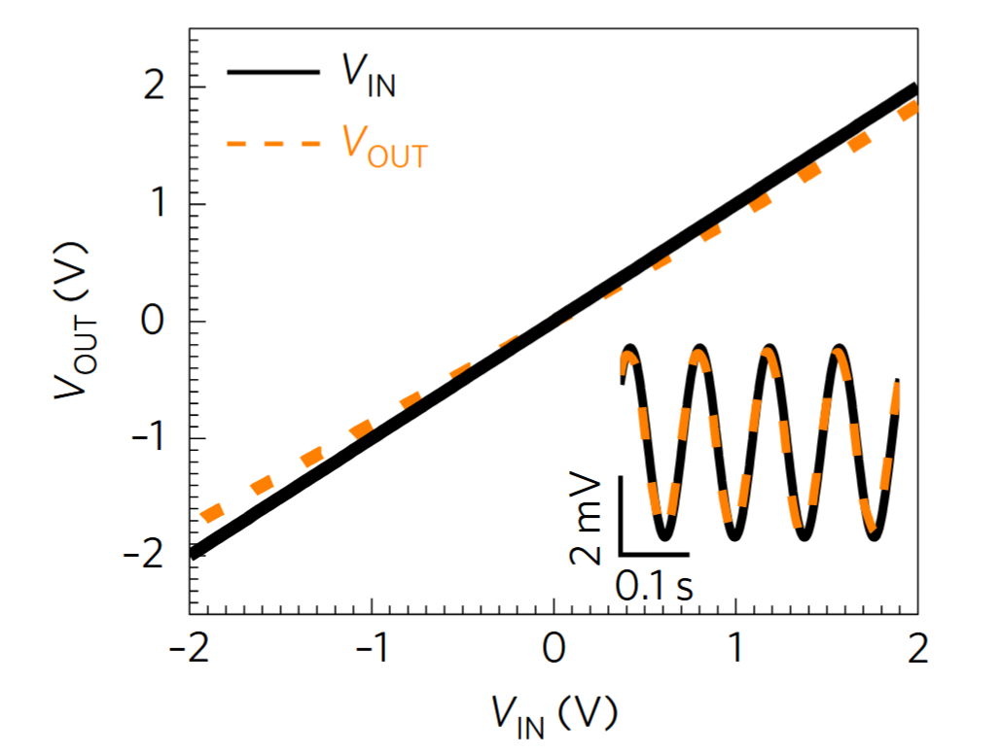
Fang, H. _et al_. _Nat Biomed Eng_ __1__, 0038 (2017) 

***
我们最初在作图时，采用的是Origin绘制原始图像+PPT拼接的模式

先分别绘制好这样的两张图：

- 图1
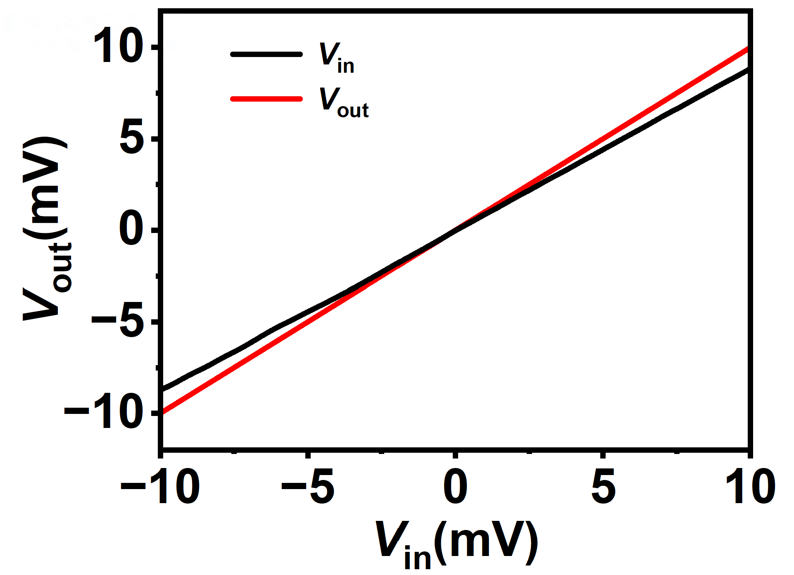
- 图2
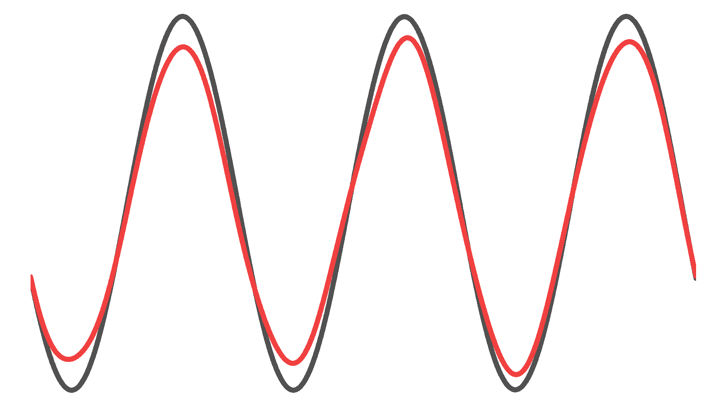
  - 图2相关设置：截取时间轴 $0-0.25\space s$，不显示所有的坐标轴和标题
- copy page，粘贴到PPT中进行修饰（如给子图添加比例尺）
- 完成的图像如下
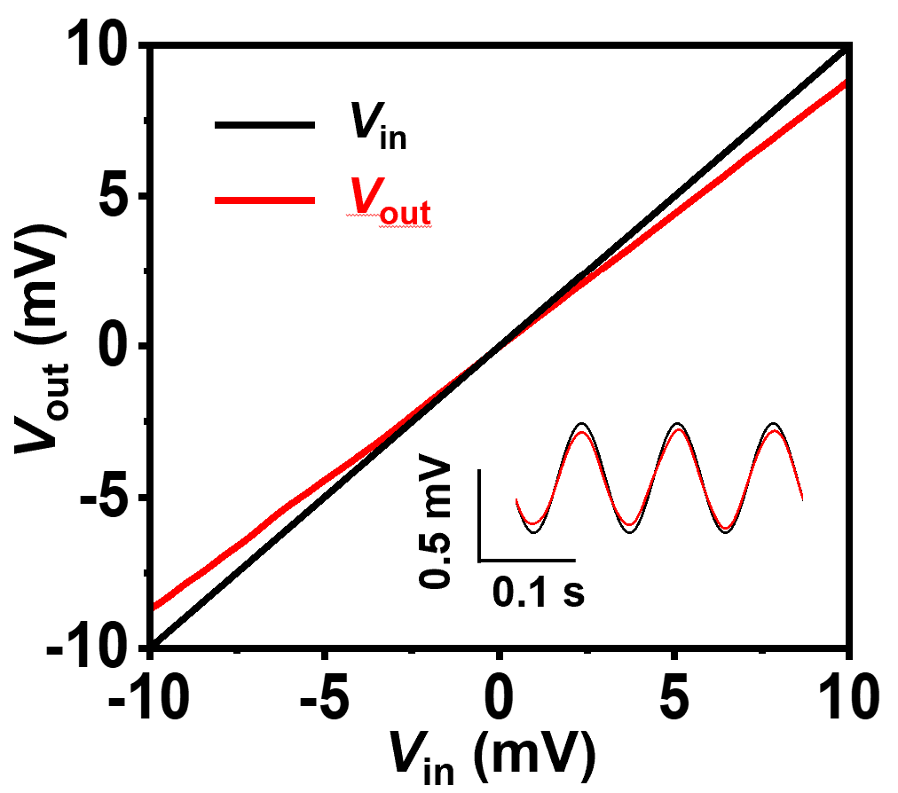

***
考虑是否可能在Origin中完成全部的操作

**方法一**

- 在同一个工程中绘制这两张图（方法同上）
- 选择Graph->Merge Graph Windows
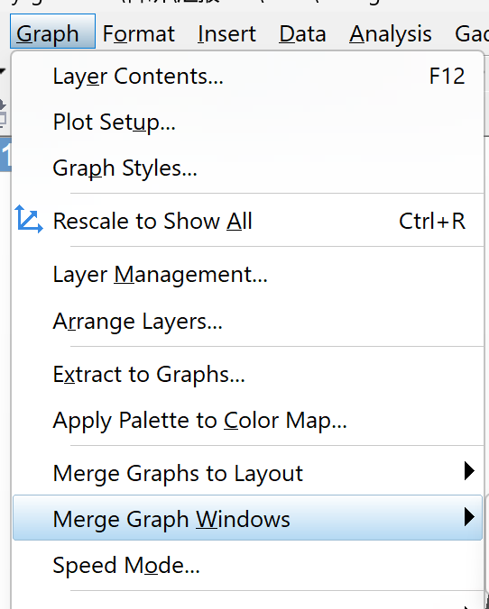
- 在打开的设置窗口中，调整两张图和layer1 layer2的对应关系，并将行数/列数均设成1（这样出来的效果就是叠放而非并列）
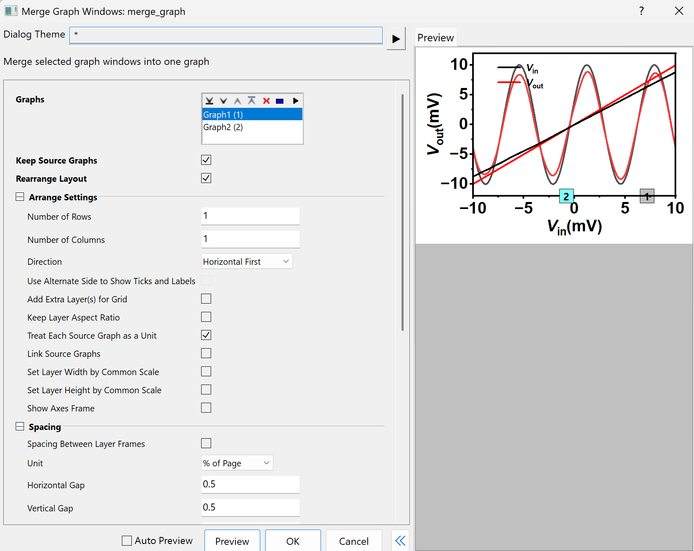

- 于是我们得到了一张完全重叠的图像
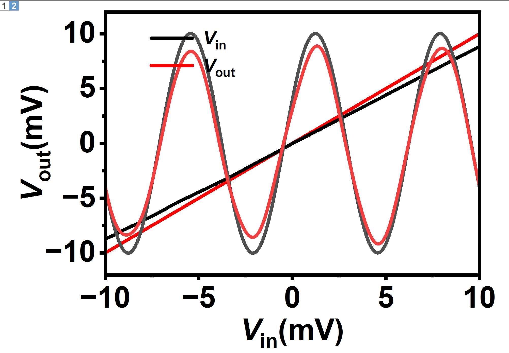
- 值得注意的是，在图像有多层时，单独选中其中一个图像较为困难。即使隐藏了其中一个图层，实际上还是会同时选中所有图层，同步缩放
- 在右侧的Object Manager中选中layer2，该图层上会出现一个浅蓝色的框，即可对其单独进行缩放
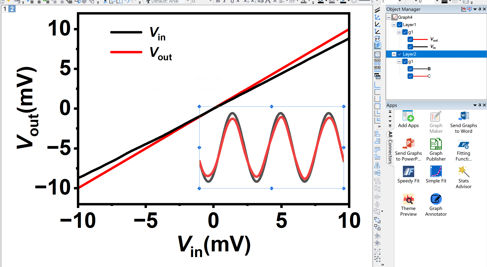
- 最后，利用直线和文本工具添加比例尺，得到最终成图
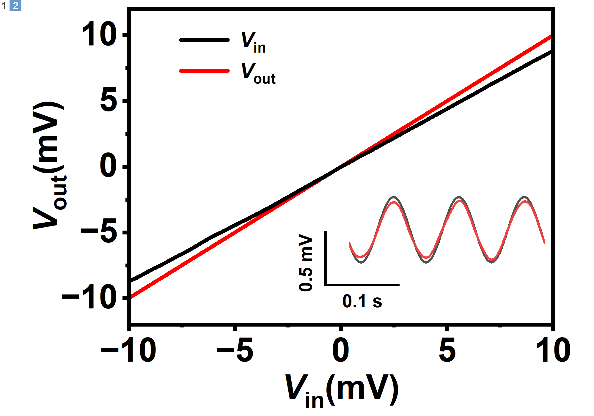

***

**方法二**
（如果两张图在不同的project中，可以采用该方法）
- 如果直接选择Copy选项，origin中会有以下几种复制方式
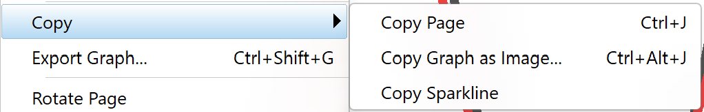
    - Copy Page  复制页面，会生成一个超链接，在粘贴位置双击该图片，可以回到原project
    - Copy Graph as Image  复制为图片，粘贴后不可编辑
    - Copy Sparkline 复制图像中选中的一条曲线
    - 这几种选项都不是我们想要的
- 同样是在Object Manager中，选中Graph2-layer1，快捷键Ctrl+C
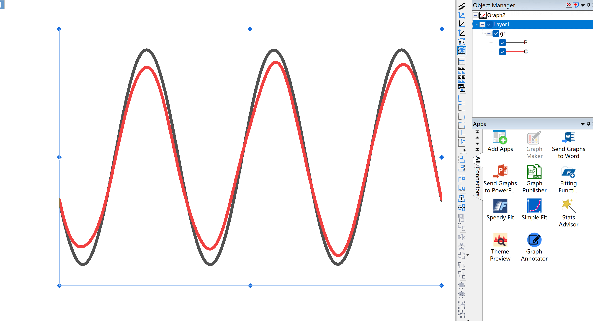
- 粘贴到Graph1中，就会自动多出一个新图层
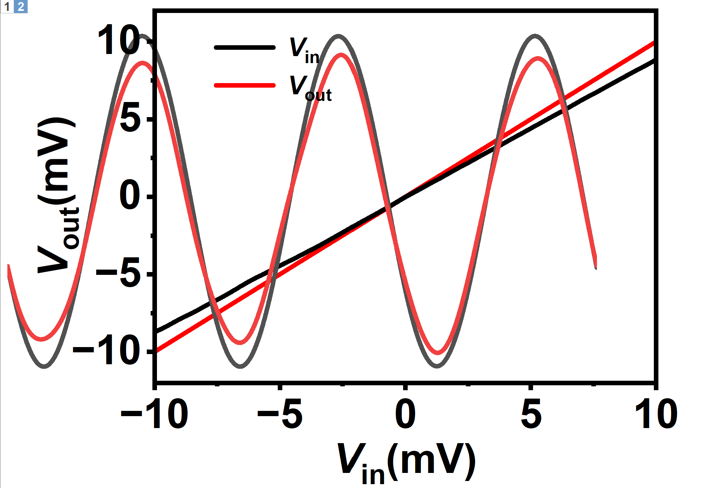
- 再用类似方法调整大小，添加比例尺即可

