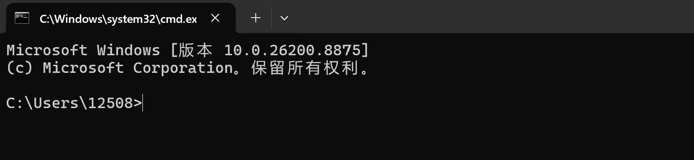
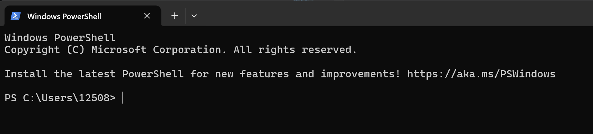
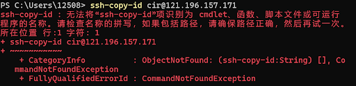

## 如何登入服务器？（Windows）
### 命令行
* 命令行是一个常用的工具了，但这次才发现cmd和powershell还是有差别的
* 打开方式均为$\mathrm {win}+R$，在搜索框中分别输入$\mathrm {cmd}$和$\mathrm {powershell}$即可




* 相比之下，powershell更为方便，之后登陆服务器均采用这一工具

### 登陆步骤
***
**密码登陆**
#### 1、发起连接
在本地终端（Terminal 或 PowerShell）中运行以下命令： 
```Bash
ssh cir@121.196.157.171
```
#### 2、输入密码
出现提示后（如果是首次连接询问 yes/no，请先输入 yes 并回车），输入默认密码，直接按回车确认（注意：粘贴时屏幕不会有任何显示）
```Bash
fj993hs9
```
#### 3、修改密码
登入服务器后，运行以下命令修改密码（修改完成后请务必在组内共享新密码）：  
```Bash
passwd
```
***
**密钥对登陆**
#### 1、生成密钥对
在本地终端复制并运行以下命令（执行后一路按回车，建议不设置密码）：  
```Bash
ssh-keygen -t ed25519 -C "your_email@example.com"
```

* 双引号中的内容只是注释，用来标明公钥是属于这台电脑的
* 注意：是在本地终端进行密钥对的配置，如果已经进入服务器，输入以下命令退出
```Bash
exit
```

#### 2、上传公钥
继续在本地终端复制并运行以下命令，将公钥部署到服务器：  
```Bash
ssh-copy-id cir@121.196.157.171
```
执行该指令时报错

原因：ssh-copy-id 是 Linux 和 Mac 系统专属的内置命令脚本，而 Windows 原生并不包含这个命令，因此会提示“无法识别”。

**替代方案**
* 复制本地公钥：运行如下命令，打开记事本，复制其中内容
```Bash
notepad $env:USERPROFILE\.ssh\id_ed25519.pub
```
* 通过密码登陆服务器，并确认服务器端有接收目录
```Bash
mkdir -p ~/.ssh
```
* 将公钥粘贴到服务器的白名单中
继续在服务器命令行中运行以下命令，打开服务器的内置文本编辑器：

```Bash
nano ~/.ssh/authorized_keys
```
* 此时终端界面会变成一个简单的文本编辑器，依次执行：

    * 粘贴：在窗口内点击鼠标右键（在 PowerShell 中，右键通常就是粘贴），将刚才记事本里的公钥代码粘贴进去。

    * 保存：按下键盘上的 Ctrl + O（字母 O），然后按下 Enter（回车键） 确认保存。

    * 退出：按下 Ctrl + X 退出编辑器，回到正常的服务器命令行。

* 退出服务器，继续后续配置

#### 3、打开配置文件
Windows 用户复制并运行：
```Bash  
notepad $env:USERPROFILE\.ssh\config
```

#### 4、写入配置信息
将以下内容完整复制，粘贴到刚才打开的配置文件中并保存：  
```Plaintext
Host free-bbs
    HostName 121.196.157.171
    User cir
    IdentityFile ~/.ssh/id_ed25519
```
* 注意：这一步记事本在保存时可能自动加上了txt的后缀，导致ssh客户端找不到该文件，需要运行以下命令删除后缀：
```Bash
Rename-Item $env:USERPROFILE\.ssh\config.txt config -ErrorAction SilentlyContinue
```
#### 5、一键登陆
配置完成后，以后每次只需在本地终端输入以下命令，即可免密码直接登入：  
```Bash
ssh free-bbs
```